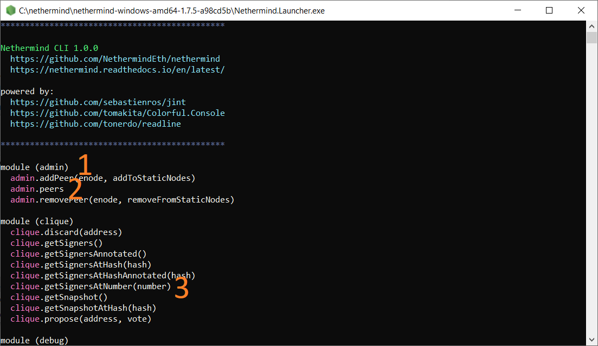
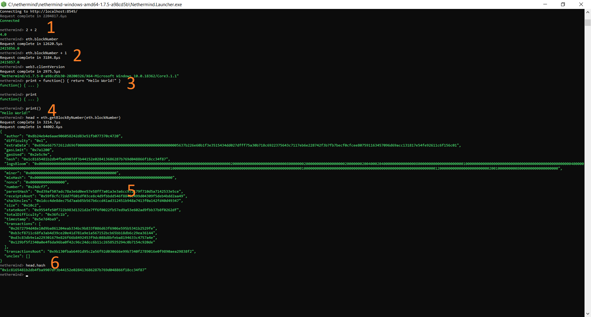

CLI
***

After launching ./Nethermind.Launcher you have two options - Node and CLI.
If you launch the Node (you have to ensure that the JsonRpc.Enabled is set to true either by enabling it when Launcher asks about it or by manually editing the relevant config file or by passing --JsonRpc.Enabled true parameter after the Launcher command) in one process and then launch the CLI in another process you will see available commands inside the CLI.

CLI will display available options (functions and properties) when started.

CLI will allow you to query the most basic info about the node quickly.

1. You can execute javascript arithmetics
2. You can issue JSON RPC requests to the node
3. You can combine the former two
4. You can create and call functions
5. You can retrieve node objects
6. And work with node object properties
7. You can also load javascript files from disk by calling load("filepath.js")
8. You can navigate to previous commands by using arrow keys
9. You can auto-complete basic command with tab 

For more advanced operations with the node use `Web3 <https://nethermind.readthedocs.io/en/latest/web3.html>`_ or ether.js libs or Truffle, Metamask, etc. 

Below you will find the available list of CLI operations and you can find more information about each call `here <https://nethermind.readthedocs.io/en/latest/jsonrpc.html>`_

admin
^^^^^

 admin.addPeer(enode, addToStaticNodes)
  <check JSON RPC docs>

 admin.peers
  <check JSON RPC docs>

 admin.removePeer(enode, removeFromStaticNodes)
  <check JSON RPC docs>

clique
^^^^^^

 clique.discard(address)
  <check JSON RPC docs>

 clique.getSigners()
  <check JSON RPC docs>

 clique.getSignersAnnotated()
  <check JSON RPC docs>

 clique.getSignersAtHash(hash)
  <check JSON RPC docs>

 clique.getSignersAtHashAnnotated(hash)
  <check JSON RPC docs>

 clique.getSignersAtNumber(number)
  <check JSON RPC docs>

 clique.getSnapshot()
  <check JSON RPC docs>

 clique.getSnapshotAtHash(hash)
  <check JSON RPC docs>

 clique.propose(address, vote)
  <check JSON RPC docs>

debug
^^^^^

 debug.deleteChainSlice(startNumber, endNumber)
  <check JSON RPC docs>

 debug.getBlockRlp(number)
  <check JSON RPC docs>

 debug.getBlockRlpByHash(hash)
  <check JSON RPC docs>

 debug.getChainlevel(number)
  <check JSON RPC docs>

 debug.config(category, name)
  <check JSON RPC docs>

 debug.traceBlock(rlp, options)
  <check JSON RPC docs>

 debug.traceBlockByHash(hash, options)
  <check JSON RPC docs>

 debug.traceBlockByNumber(number, options)
  <check JSON RPC docs>

 debug.traceTransaction(hash, options)
  <check JSON RPC docs>

 debug.traceTransactionByBlockAndIndex(hash, options)
  <check JSON RPC docs>

 debug.traceTransactionByBlockhashAndIndex(hash, options)
  <check JSON RPC docs>

 debug.traceTransactionInBlockByHash(rlp, hash, options)
  <check JSON RPC docs>

 debug.traceTransactionInBlockByIndex(rlp, index, options)
  <check JSON RPC docs>

diag
^^^^

 diag.cliVersion
  <check JSON RPC docs>

eth
^^^

 eth.blockNumber
  <check JSON RPC docs>

 eth.getProof(address, storageKeys, blockParameter)
  <check JSON RPC docs>

 eth.call(tx, blockParameter)
  <check JSON RPC docs>

 eth.chainId
  <check JSON RPC docs>

 eth.estimateGas(json)
  <check JSON RPC docs>

 eth.getBalance(address, blockParameter)
  <check JSON RPC docs>

 eth.getBlockByHash(hash, returnFullTransactionObjects)
  <check JSON RPC docs>

 eth.getBlockByNumber(blockParameter, returnFullTransactionObjects)
  <check JSON RPC docs>

 eth.getBlockTransactionCountByHash(hash)
  <check JSON RPC docs>

 eth.getBlockTransactionCountByNumber(blockParameter)
  <check JSON RPC docs>

 eth.getCode(address, blockParameter)
  <check JSON RPC docs>

 eth.getLogs(filter)
  <check JSON RPC docs>

 eth.getStorageAt(address, positionIndex, blockParameter)
  <check JSON RPC docs>

 eth.getTransactionByBlockNumberAndIndex(blockParameter, index)
  <check JSON RPC docs>

 eth.getTransactionByHash(txHash)
  <check JSON RPC docs>

 eth.getTransactionCount(address, blockParameter)
  <check JSON RPC docs>

 eth.getTransactionReceipt(txHash)
  <check JSON RPC docs>

 eth.getUncleCountByBlockNumber(blockParameter)
  <check JSON RPC docs>

 eth.pendingTransactions
  <check JSON RPC docs>

 eth.protocolVersion
  <check JSON RPC docs>

 eth.sendEth(from, to, amountInEth)
  <check JSON RPC docs>

 eth.sendRawTransaction(txRlp)
  <check JSON RPC docs>

 eth.sendTransaction(tx)
  <check JSON RPC docs>

 eth.sendWei(from, to, amountInWei)
  <check JSON RPC docs>

net
^^^

 net.localEnode
  <check JSON RPC docs>

 net.peerCount
  <check JSON RPC docs>

 net.version
  <check JSON RPC docs>

node
^^^^

 node.address
  Displays the address of the node key (the key that is used for network identity).

 node.enode
  Displays the currently connected node enode value.

 node.setNodeKey(key)
  <check JSON RPC docs>

 node.switch(uri)
  Changes the address of the node that the CLI is talking to.

 node.switchLocal(port)
  Changes the address of the node that the CLI is talking to localhost:port.

 node.uri
  Displays the URL of the node that the CLI is currently talking to.

parity
^^^^^^

 parity.getBlockReceipts(blockParameter)
  Returns receipts from all transactions from particular block

 parity.pendingTransactions()
  Returns the pending transactions using Parity format

personal
^^^^^^^^

 personal.listAccounts
  <check JSON RPC docs>

 personal.lockAccount(addressHex)
  <check JSON RPC docs>

 personal.newAccount(password)
  <check JSON RPC docs>

 personal.unlockAccount(addressHex, password)
  <check JSON RPC docs>

proof
^^^^^

 proof.call(tx, blockParameter)
  <check JSON RPC docs>

 proof.getTransactionByHash(transactionHash, includeHeader)
  <check JSON RPC docs>

 proof.getTransactionReceipt(transactionHash, includeHeader)
  <check JSON RPC docs>

system
^^^^^^

 system.getVariable(name, defaultValue)
  <check JSON RPC docs>

 system.memory
  <check JSON RPC docs>

trace
^^^^^

 trace.replayBlockTransactions(blockNumber, traceTypes)
  Replays all transactions in a block returning the requested traces for each transaction.

 trace.replayTransaction(txHash, traceTypes)
  Replays a transaction, returning the traces.

 trace.block(blockNumber)
  Returns traces created at given block.

 trace.rawTransaction(txData, traceTypes)
  Traces a call to eth_sendRawTransaction without making the call, returning the traces

 trace.transaction(txHash)
  Returns all traces of given transaction

txpool
^^^^^^

 txpool.content
  <check JSON RPC docs>

 txpool.inspect
  <check JSON RPC docs>

 txpool.status
  <check JSON RPC docs>

web3
^^^^

 web3.abi(name)
  <check JSON RPC docs>

 web3.clientVersion
  <check JSON RPC docs>

 web3.sha3(data)
  <check JSON RPC docs>

 web3.toDecimal(hex)
  <check JSON RPC docs>

