Cloud
*****

Digital Ocean
^^^^^^^^^^^^^

Create a new droplet

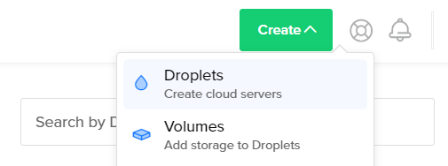

Select Ubuntu version (18.10)

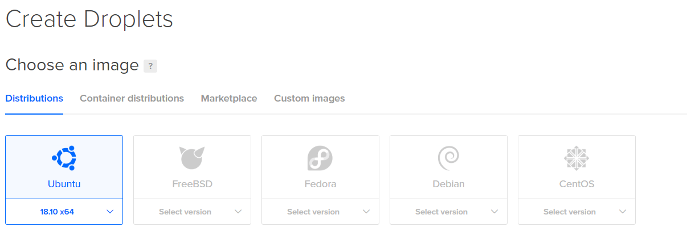

Choose the minimal option

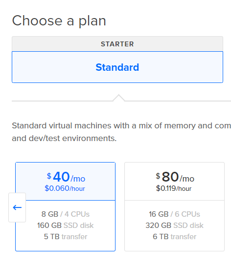

Select preferred region (some will sync faster)

.. image:: clouds/do/4.png

Choose a hostname

.. image:: clouds/do/5.png

Wait for the droplet to be created

.. image:: clouds/do/6.png

Install packages::

  sudo apt-get update && sudo apt-get install libsnappy-dev libc6-dev libc6 unzip

.. image:: clouds/do/7.png

Wait for the packages (input 'Y' when prompted)

.. image:: clouds/do/8.png

Download Nethermind Launcher (you may need to change the url to download the latest version, check `here <https://github.com/NethermindEth/nethermind/releases>`_.)::

  wget wget https://github.com/NethermindEth/nethermind/releases/download/1.5.8/nethermind-linux-amd64-1.5.8-b482b39.zip

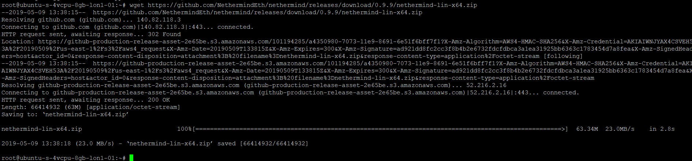

Unzip the package::

  unzip nethermind-linux-amd64-1.5.8-b482b39.zip -d nethermind && cd nethermind

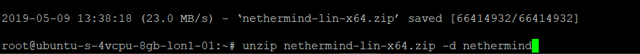
.. image:: clouds/do/11.png

Launch screen (and press ENTER)::

  screen

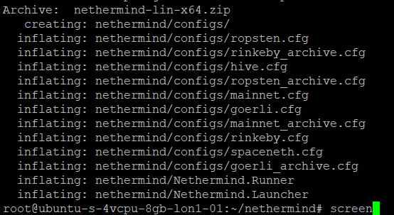
.. image:: clouds/do/13.png

Launch Nethermind::

  ./Nethermind.Launcher

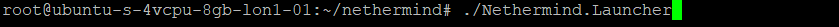

Select the network

.. image:: clouds/do/16.png

Select the sync mode (fast sync or full archive)

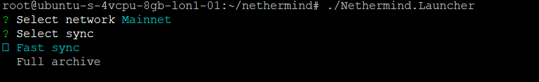

It can take some time (up to a few minutes before it finds the first nodes to sync with):

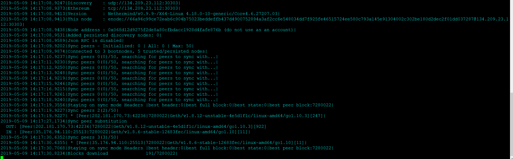

UpCloud
^^^^^^^

Deploy a new server

.. image:: clouds/upcloud/1.png

Select preferred region (some will sync faster)

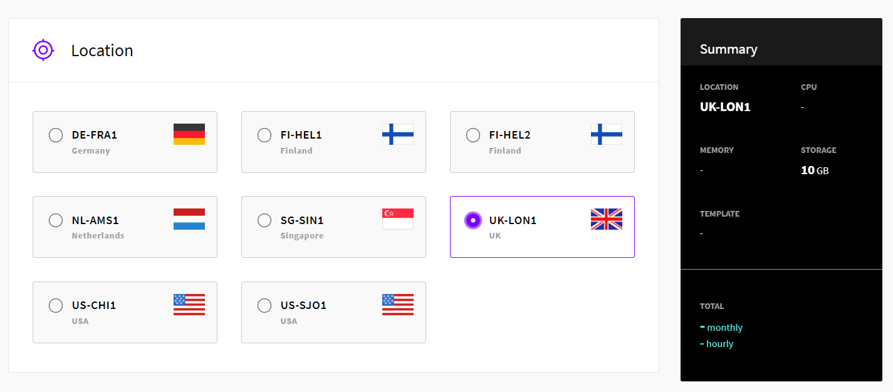

Choose the server size ($5 is enough for Goerli, $40 is enough for the mainnet fast sync)

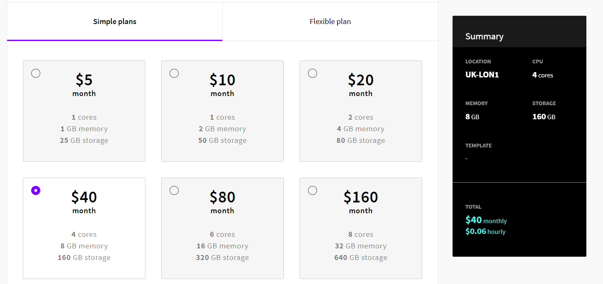
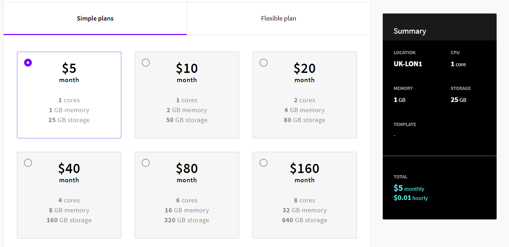

Leave the storage size unchanged

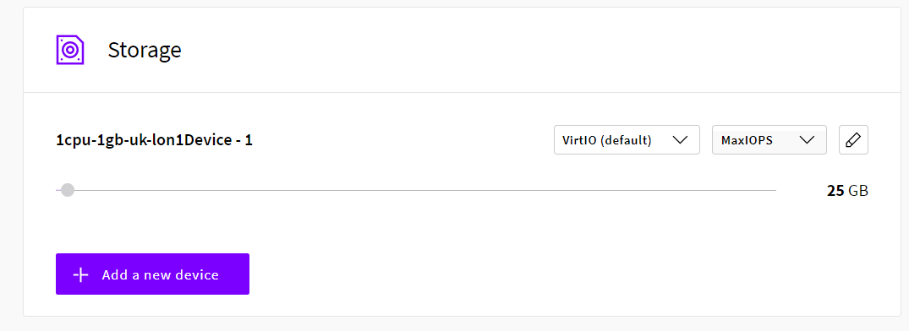

Choose the operating system (Ubuntu 18.04)

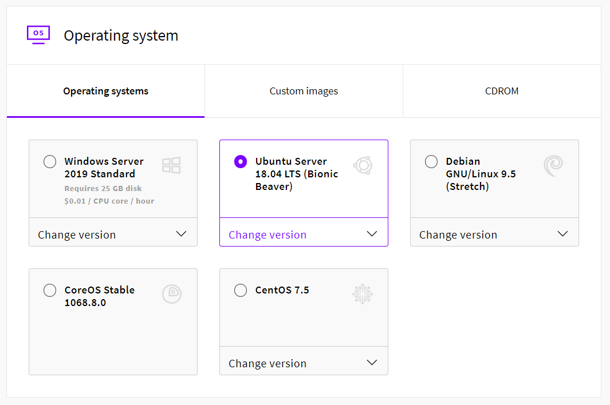

Choose a hostname

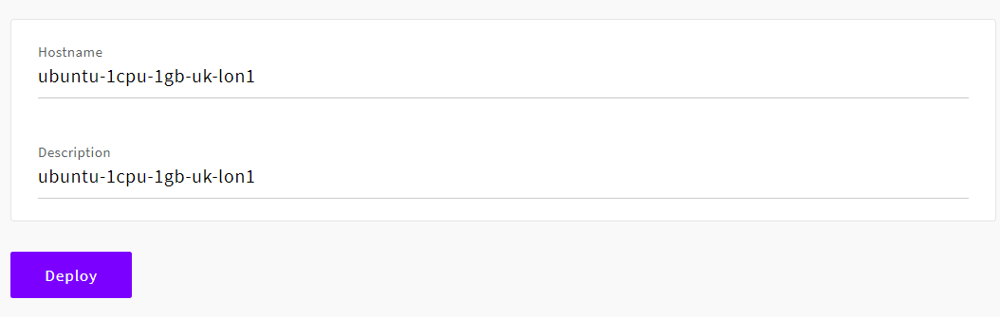

Install packages::

  sudo apt-get update && sudo apt-get install libsnappy-dev libc6-dev libc6 unzip

.. image:: clouds/do/7.png

Wait for the packages (input 'Y' when prompted)

.. image:: clouds/do/8.png

Download Nethermind Launcher (you may need to change the url to download the latest version, check `here <https://github.com/NethermindEth/nethermind/releases>`_.)::

  wget https://github.com/NethermindEth/nethermind/releases/download/1.5.8/nethermind-linux-amd64-1.5.8-b482b39.zip

Unzip the package::

  unzip nethermind-linux-amd64-1.5.8-b482b39.zip -d nethermind && cd nethermind

.. image:: clouds/do/11.png

Launch screen (and press ENTER)::

  screen

.. image:: clouds/do/13.png

Launch Nethermind::

  ./Nethermind.Launcher

Select the network

.. image:: clouds/do/16.png

Select the sync mode (fast sync or full archive)

It can take some time (up to a few minutes before it finds the first nodes to sync with):

Google Cloud
^^^^^^^^^^^^

Based on our tests it is probably the third best option from the providers listed here (after UpCloud and Digital Ocean).
Should be fine (although more expensive) for fast syncing nodes. Full archive is not reasonable with the price / IOPS ratio.

AWS
^^^

Based on our tests it is probably the fourth best option from the providers listed here (after UpCloud, Digital Ocean, and Google Cloud).
Should be fine (although more expensive) for fast syncing nodes. Full archive is not reasonable with the price / IOPS ratio.

Azure
^^^^^

Based on our tests it is probably the worst choice from the providers listed here.
Should be fine (although more expensive) for fast syncing nodes. Full archive is not reasonable with the price / IOPS ratio.
