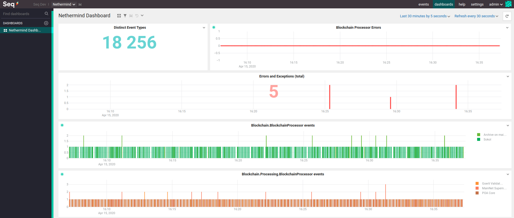
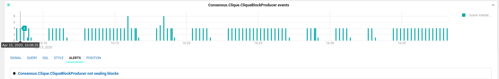
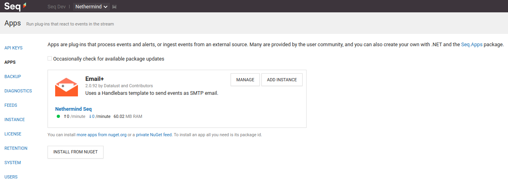
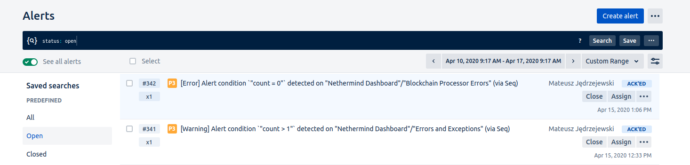
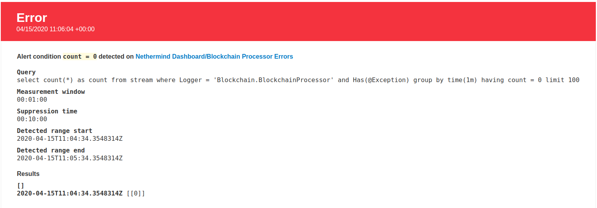
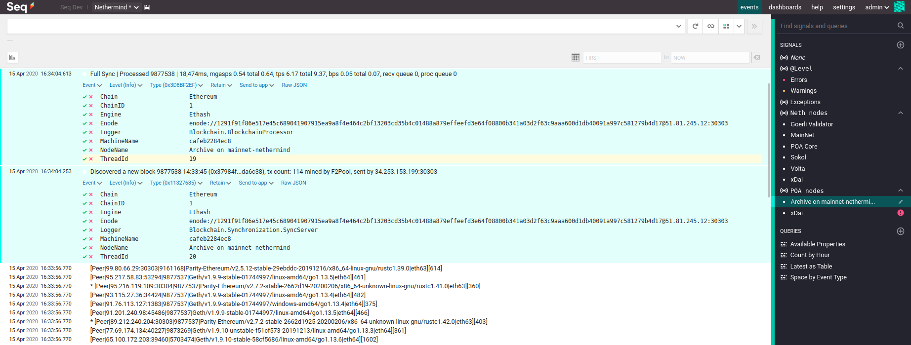
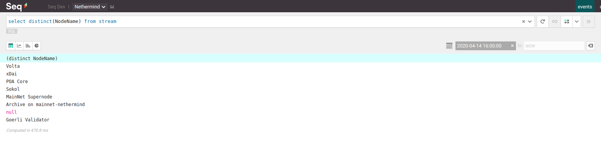

Enterprise
**********

Nethermind supports clients through monitoring their Ethereum Nodes with a nice and handy tools such as ``Grafana`` or ``Seq``.

Seq 
^^^

With `Seq <https://datalust.co/seq>`_  you can quickly identify and diagnose problems with your Nethermind nodes. You can setup dashboards to monitor node's behaviour and also send alerts whenever critical errors occur. With the help of NLog logging the application logs are being sent over to a Seq instance to enable monitoring. You can easily search through the events by simply writing SQL queries.

Clients can entrust monitoring and support of the nodes to us or configure their own dashboard and Seq tools. Nethermind team can use Seq dashboards and alerts to quickly address any production issues and outages.

Dashboards and Alerts
---------------------

In Seq we are able to visualize events data with simple charts. They're very useful when it comes to alert the Team when something wrong happens with nodes.

The Alert is set up to trigger when the Validator node stops sealing blocks in a specified measurement window.

The Alert is being sent to our `OpsGenie <https://www.atlassian.com/software/opsgenie>`_ instance over the SMTP server configured via one of the Apps which are plug-ins that process events and alerts, or ingest events from an external source.
There are many of them created and provided by the community. In our example we use an ``Email+`` 2.0.92 provided by Datalust and Contributors.

When the alert reaches the OpsGenie, phone notfications are being sent to our on-call Teams.

We can also view them in a nice HTML format which can be also configured in Seq.

Logs 
----

With the power of structured logging we can quickly check the source of an event. It's useful when diagnosing problems with Ethereum nodes, we can verify the source of an error in a second.
It is very easy to create some handy filters and queries which can be reused.

SQL queries
-----------

The most popular database query language can be used to query over application logs.

