Private Networks
****************

It is possible to configure a private network (private blockchain) using Nethermind nodes. Before you setup a private network you will need to make a few decisions. One of them is choosing a consensus protocol that will be used for securing the network.

Consensus Algorithms
====================

Nethermind supports the following consensus algorithms:

* ethash (PoW)
* AuRa (PoA)
* Clique (PoA)
* NethDev (debug / dev)

PoW
^^^

In the proof of work consensus algorithm some of the nodes participate in a race to mine a new block by solving a mathematical puzzle. The difficulty of the puzzle (the amount of computation needed to find a solution) is adjusted so as to make blocks appear with some average frequency (every 15 seconds on the Ethereum mainnet). PoW is currently used to secure the public Ethereum mainnet and the Ropsten testnet. The only mining algorithm used for PoW in Ethereum is called ethash and is designed to be strict memory hard (see `Strict Memory Hard Hashing Functions <http://www.hashcash.org/papers/memohash.pdf>`_).

Clique
^^^^^^

Clique is an implementation of the Proof of Authority (PoA) consensus algorithm. The idea behind PoA is to choose a group of nodes within the network with authority to create (seal) new blocks. In Clique such nodes are called signers and after the initial setup signers can vote to add new signers to the group or to remove any of the existing signers. Clique is currently supported by Geth, Parity, Nethermind and Pantheon and is used to secure the Goerli and Rinkeby testnets. 

AuRa
^^^^

AuRa is another implementation of the Proof of Authority consensus algorithm. It is currently only supported by Nethermind and Parity Ethereum client. Aura is used to secure the Kovan testnet and the POA Network.

NethDev (we also call it Spaceneth)
^^^^^^^

NethDev is a very simple consensus algorithm (or to better describe it - lack of consensus algorithm). NethDev can be used for setting up nodes for development and testing purposes. On the NethDev network any node can create a block with transactions and as long as it is a valid Ethereum block all other nodes will accept it.

Configuration
=============

Nethermind uses the same format chainspec files that can be used for setting up private networks in Parity. Most of the elements of the chainspec files are supported by Nethermind:

* consensus engine and its parameters (to choose between Ethash, Clique, AuRa or NethDev)
* genesis block spec
* EIP transitions
* initial account allocations
* bootnodes

The following elements are NOT supported at the moment:

* hardcoded sync block hashes
* precompile definitions and precompile activation blocks

You can find below links to some of the chainspec files used to define various Ethereum networks:

* `foundation <https://github.com/NethermindEth/nethermind/blob/09389fc28b37605acc5eaed764d3e973969fe319/src/Nethermind/Chains/foundation.json>`_ - the public Ethereum mainnet
* `rinkeby <https://github.com/NethermindEth/nethermind/blob/09389fc28b37605acc5eaed764d3e973969fe319/src/Nethermind/Chains/rinkeby.json>`_ - the original Clique based testnet
* `goerli <https://github.com/NethermindEth/nethermind/blob/09389fc28b37605acc5eaed764d3e973969fe319/src/Nethermind/Chains/goerli.json>`_ - the new Clique based testnet
* `spaceneth <https://github.com/NethermindEth/nethermind/blob/09389fc28b37605acc5eaed764d3e973969fe319/src/Nethermind/Chains/spaceneth.json>`_ - a private network example with NethDev

How to setup a Nethermind only Clique based chain
=================================================

Prerequisites
^^^^^^^^^^^^^
* Linux bash shell
* Docker-compose
* Docker
* jq

::

    sudo apt-get install -y docker-compose docker.io jq
    
Setup
^^^^^

In this setup we will create a private network of 3 Nethermind nodes running Clique consensus algorithm.

1. create separate directory where we will store all files

::

    mkdir private-networking
    cd private-networking

2. create folders for each node and genesis

::

    mkdir node_1 node_2 node_3 genesis

3. download `chainspec <https://raw.githubusercontent.com/NethermindEth/nethermind/09389fc28b37605acc5eaed764d3e973969fe319/src/Nethermind/Chains/goerli.json>`_ file with clique engine and place it in ``genesis`` folder (we will be using goerli chainspec in this example)

::

    wget https://raw.githubusercontent.com/NethermindEth/nethermind/09389fc28b37605acc5eaed764d3e973969fe319/src/Nethermind/Chains/goerli.json
    cp goerli.json genesis/goerli.json

4. create subfolders in each node folder

::

    mkdir node_1/configs node_1/staticNodes node_2/configs node_2/staticNodes node_3/configs node_3/staticNodes

5. create a ``static-nodes.json`` file and place it in node_1/staticNodes subfolders (do this for node_2 and node_3 as well)

::

    cat <<EOF > node_1/staticNodes/static-nodes.json
    [

    ]
    EOF

6. create ``config.cfg`` file and place it in ``node_1/configs`` subfolders (do this for node_2 and node_3 as well)

::

  cat <<EOF > node_1/configs/config.cfg
  {
      "Init": {
          "WebSocketsEnabled": false,
          "StoreReceipts" : true,
          "EnableUnsecuredDevWallet": true,
          "IsMining": true,
          "ChainSpecPath": "/config/genesis/goerli.json",
          "BaseDbPath": "nethermind_db/clique",
          "LogFileName": "clique.logs.txt",
          "StaticNodesPath": "Data/static-nodes.json"
      },
      "Network": {
          "DiscoveryPort": 30300,
          "P2PPort": 30300,
          "LocalIp": "10.5.0.2",
          "ExternalIp": "10.5.0.2"
      },
      "JsonRpc": {
          "Enabled": true,
          "Host": "10.5.0.2",
          "Port": 8545
      },
      "KeyStoreConfig": {
          "TestNodeKey": "8687A55019CCA647F6C063F530D47E9A90725D62D853F4B973E589DB24CA9305"
      }    
  }
  EOF

For each node you will need to change following items in configuration:

* ``TestNodeKey`` should be a 64 character length alphanumeric string. Can be generate with ``pwgen`` tool for example.
* ``LocalIp``, ``ExternalIp`` and ``Host`` should have the same value and be incremented for each node e.g. 10.5.0.3, 10.5.0.4 and so on and so forth.

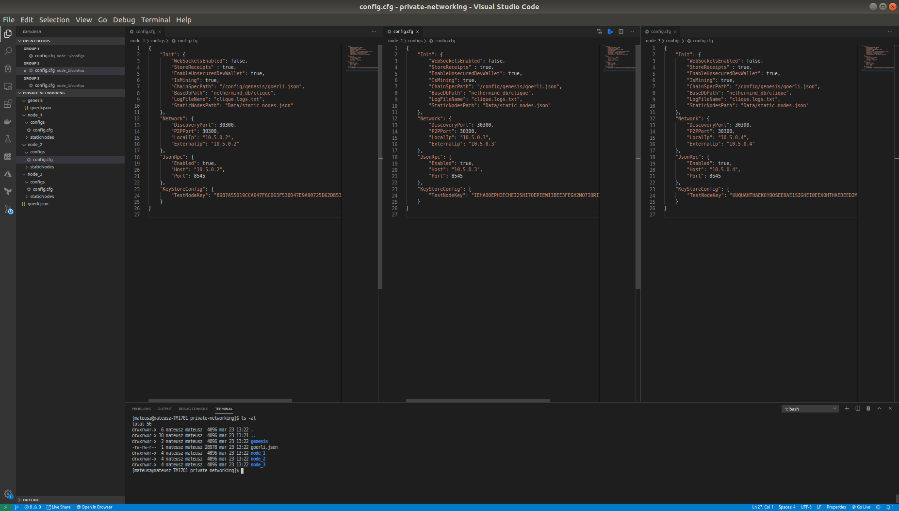

7. copy ``docker-compose`` file and place it in working directory

::

  version: "3.5"
  services:

      node_1:
          image: nethermind/nethermind:alpine
          command: --config config
          volumes:
              - ./genesis:/config/genesis
              - ./node_1/configs/config.cfg:/nethermind/configs/config.cfg
              - ./node_1/staticNodes/static-nodes.json:/nethermind/Data/static-nodes.json
              - ./node_1/db/clique:/nethermind/nethermind_db/clique
              - ./node_1/keystore:/nethermind/keystore
          ports:
              - 0.0.0.0:8547:8545
          networks:
              vpcbr:
                  ipv4_address: 10.5.0.2

      node_2:
          image: nethermind/nethermind:alpine
          command: --config config
          volumes:
              - ./genesis:/config/genesis
              - ./node_2/configs/config.cfg:/nethermind/configs/config.cfg
              - ./node_2/staticNodes/static-nodes.json:/nethermind/Data/static-nodes.json
              - ./node_2/db/clique:/nethermind/nethermind_db/clique
              - ./node_2/keystore:/nethermind/keystore
          ports:
              - 0.0.0.0:8548:8545
          networks:
              vpcbr:
                  ipv4_address: 10.5.0.3

      node_3:
          image: nethermind/nethermind:alpine
          command: --config config
          volumes:
              - ./genesis:/config/genesis
              - ./node_3/configs/config.cfg:/nethermind/configs/config.cfg
              - ./node_3/staticNodes/static-nodes.json:/nethermind/Data/static-nodes.json
              - ./node_3/db/clique:/nethermind/nethermind_db/clique
              - ./node_3/keystore:/nethermind/keystore
          ports:
              - 0.0.0.0:8549:8545
          networks:
              vpcbr:
                  ipv4_address: 10.5.0.4

  networks:
      vpcbr:
          driver: bridge
          ipam:
              config:
                  - subnet: 10.5.0.0/16

8. run each node separately so that we can copy ``Enode`` and ``Node address`` for each node, we will use them later

::

    docker-compose run node_1

Stop the node when Nethermind initialization completes ``Ctrl +C``.
Copy ``This node`` and ``Node address`` (without 0x prefixes) values to a text file.
Continue with node_2 and node_3.

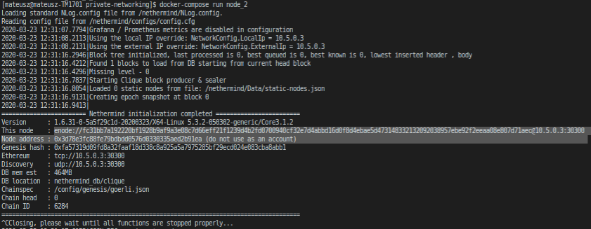

Tip: 

You can use ``Nethermind.Cli`` to fetch these values from nodes by executing the following:

::

    node.switch("http://localhost:8547")
    node.enode
    node.address

``Nethermind.Cli`` can be found in packages on `Github Releases <https://github.com/NethermindEth/nethermind/releases>`_ or `Download Page <http://downloads.nethermind.io/>`_.

9. the file should look similar to this:

::

    SIGNER_1="b5bc4d9e63eb1cb16aeeb0fd08e8344283b45b0d"
    STATIC_NODE_1="enode://2281549869465d98e90cebc45e1d6834a01465a990add7bcf07a49287e7e66b50ca27f9c70a46190cef7ad746dd5d5b6b9dfee0c9954104c8e9bd0d42758ec58@10.5.0.2:30300"
    SIGNER_2="c4e3a14d33f765faaca31672bd90d0c325bfa0cf"
    STATIC_NODE_2="enode://37878ec16a5ed87c9c80b4648e5428f5c768eddd79483be118319c49d11c4e535dac328b5216696cefe0792b7b64adc4de3aeb377550651e982590e62e5a500e@10.5.0.3:30300"
    SIGNER_3="0076873eb11c627057834fdbdc7b391a33eb9f81"
    STATIC_NODE_3="enode://6067f06d84c207e6233dacf1f3ef961bd7231f71d5425cbaf843cf19cfd5f7e13b024d234e4e5f6175bdb37c0bbccd14488b481b2280efb66d0631a20ae13ea3@10.5.0.4:30300"

10. copy & paste above variables into your terminal and create ``EXTRA_VANITY`` and ``EXTRA_SEAL`` variables

::

    EXTRA_VANITY="0x22466c6578692069732061207468696e6722202d204166726900000000000000"
    EXTRA_SEAL="0000000000000000000000000000000000000000000000000000000000000000000000000000000000000000000000000000000000000000000000000000000000"

11. create ``EXTRA_DATA`` variable accordingly to https://eips.ethereum.org/EIPS/eip-225

::

    EXTRA_DATA=${EXTRA_VANITY}${SIGNER_1}${SIGNER_2}${SIGNER_3}${EXTRA_SEAL}

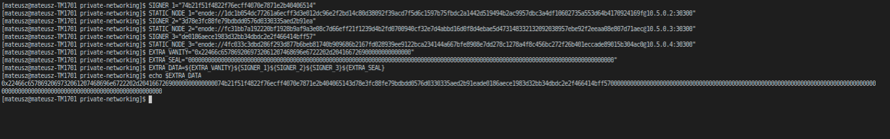

12. in ``goerli.json`` chainspec file, modify ``extraData`` property in ``genesis`` field 

You can do this either manually or using below command

::

    cat goerli.json | jq '.genesis.extraData = '\"$EXTRA_DATA\"'' > genesis/goerli.json

13. for each node modify previously created empty ``static-nodes.json`` files by appending ``Enodes`` to them

::

    cat <<EOF > node_1/staticNodes/static-nodes.json
    [
        "$STATIC_NODE_1",
        "$STATIC_NODE_2",
        "$STATIC_NODE_3"
    ]
    EOF

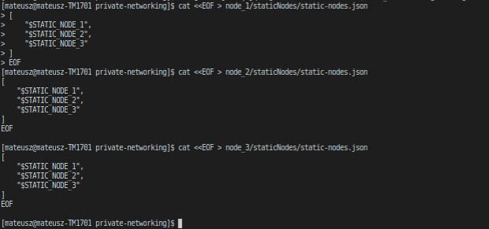

14. remove databases for each node

::

    sudo rm -rf node_1/db/clique node_2/db/clique node_3/db/clique

15. finally run ``docker-compose`` file

::

    docker-compose up

You should see the private network working and nodes sealing blocks in Clique consensus algorithm.

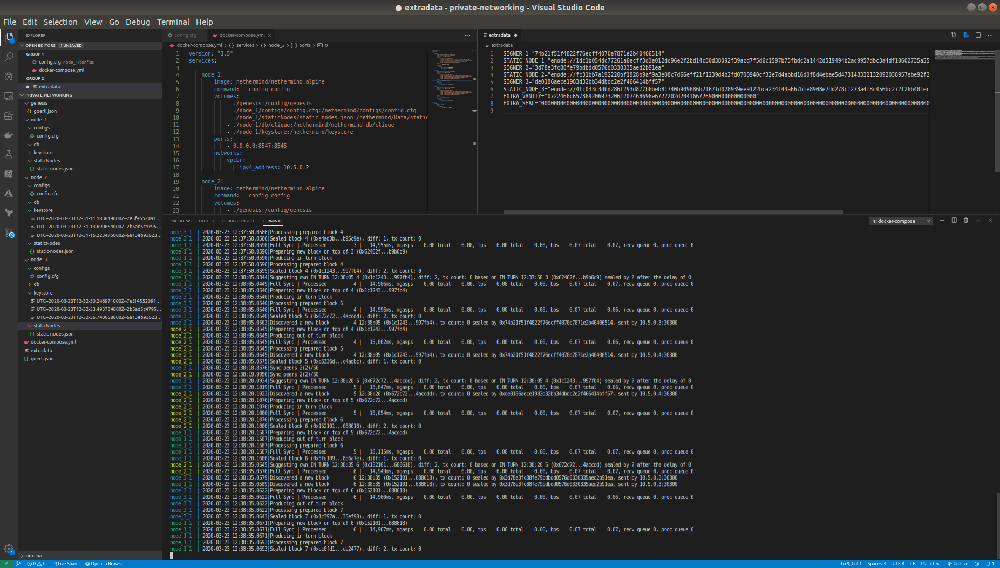

How to setup a Nethermind only Spaceneth based chain
====================================================

Spaceneth private network setup looks very similar to the above Clique setup.
However, there are few major differences and will be described below.

Prerequisites
^^^^^^^^^^^^^
* Linux bash shell
* Docker-compose
* Docker
* jq
* Nethermind.Cli

::

    sudo apt-get install -y docker-compose docker.io jq

``Nethermind.Cli`` can be found in packages on `Github Releases <https://github.com/NethermindEth/nethermind/releases>`_ or `Download Page <http://downloads.nethermind.io/>`_.

Setup
^^^^^

In this setup we will create a private network of 3 Nethermind nodes running a simple testing NethDev consensus algorithm.

1. create separate directory where we will store all files

::

    mkdir private-networking
    cd private-networking

2. create folders for each node and genesis

::

    mkdir node_1 node_2 node_3 genesis

3. download `chainspec <https://raw.githubusercontent.com/NethermindEth/nethermind/master/src/Nethermind/Chains/spaceneth.json>`_ file with clique engine and place it in ``genesis`` folder.

::

    wget https://raw.githubusercontent.com/NethermindEth/nethermind/master/src/Nethermind/Chains/spaceneth.json
    cp spaceneth.json genesis/spaceneth.json

4. create subfolders in each node folder

::

    mkdir node_1/configs node_1/staticNodes node_2/configs node_2/staticNodes node_3/configs node_3/staticNodes

5. create a ``static-nodes.json`` file and place it in node_1/staticNodes subfolders (do this for node_2 and node_3 as well)

::

    cat <<EOF > node_1/staticNodes/static-nodes.json
    [

    ]
    EOF

6. create ``config.cfg`` file and place it in ``node_1/configs`` subfolders (do this for node_2 and node_3 as well)

::

  cat <<EOF > node_1/configs/config.cfg
  {
      "Init": {
          "WebSocketsEnabled": false,
          "StoreReceipts" : true,
          "EnableUnsecuredDevWallet": true,
          "IsMining": true,
          "ChainSpecPath": "/config/genesis/spaceneth.json",
          "BaseDbPath": "nethermind_db/spaceneth",
          "LogFileName": "spaceneth.logs.txt",
          "StaticNodesPath": "Data/static-nodes.json"
      },
      "Network": {
          "DiscoveryPort": 30300,
          "P2PPort": 30300,
          "LocalIp": "10.5.0.2",
          "ExternalIp": "10.5.0.2"
      },
      "JsonRpc": {
          "Enabled": true,
          "Host": "10.5.0.2",
          "Port": 8545
      } 
  }
  EOF

For each node you will need to change following items in configuration:

* ``LocalIp``, ``ExternalIp`` and ``Host`` should have the same value and be incremented for each node e.g. 10.5.0.3, 10.5.0.4 and so on and so forth.

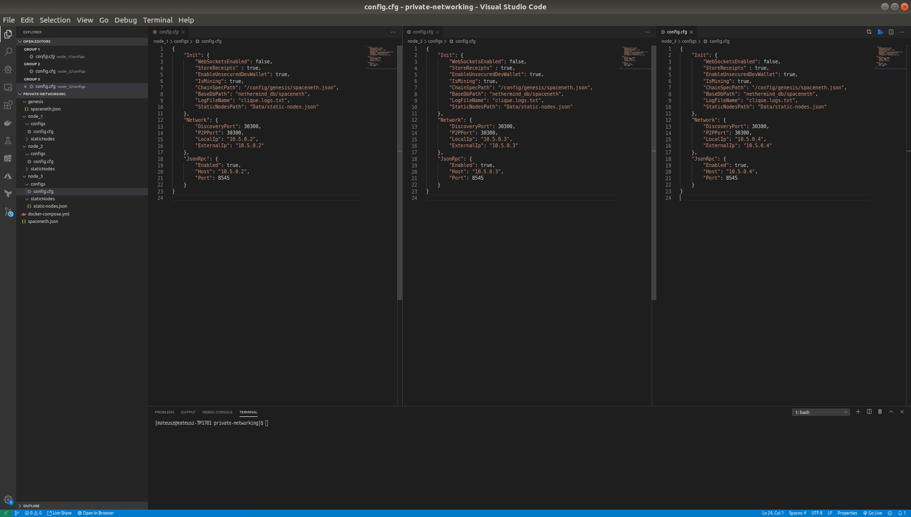

7. copy ``docker-compose`` file and place it in working directory

::

  version: "3.5"
  services:

      node_1:
          image: nethermind/nethermind:alpine
          command: --config config
          volumes:
              - ./genesis:/config/genesis
              - ./node_1/configs/config.cfg:/nethermind/configs/config.cfg
              - ./node_1/staticNodes/static-nodes.json:/nethermind/Data/static-nodes.json
              - ./node_1/db/spaceneth:/nethermind/nethermind_db/spaceneth
              - ./node_1/keystore:/nethermind/keystore
          ports:
              - 0.0.0.0:8547:8545
          networks:
              vpcbr:
                  ipv4_address: 10.5.0.2

      node_2:
          image: nethermind/nethermind:alpine
          command: --config config
          volumes:
              - ./genesis:/config/genesis
              - ./node_2/configs/config.cfg:/nethermind/configs/config.cfg
              - ./node_2/staticNodes/static-nodes.json:/nethermind/Data/static-nodes.json
              - ./node_2/db/spaceneth:/nethermind/nethermind_db/spaceneth
              - ./node_2/keystore:/nethermind/keystore
          ports:
              - 0.0.0.0:8548:8545
          networks:
              vpcbr:
                  ipv4_address: 10.5.0.3

      node_3:
          image: nethermind/nethermind:alpine
          command: --config config
          volumes:
              - ./genesis:/config/genesis
              - ./node_3/configs/config.cfg:/nethermind/configs/config.cfg
              - ./node_3/staticNodes/static-nodes.json:/nethermind/Data/static-nodes.json
              - ./node_3/db/spaceneth:/nethermind/nethermind_db/spaceneth
              - ./node_3/keystore:/nethermind/keystore
          ports:
              - 0.0.0.0:8549:8545
          networks:
              vpcbr:
                  ipv4_address: 10.5.0.4

  networks:
      vpcbr:
          driver: bridge
          ipam:
              config:
                  - subnet: 10.5.0.0/16

8. run each node separately so that we can copy ``Enode`` for each node, we will use them later

::

    docker-compose run node_1

Stop the node when Nethermind initialization completes ``Ctrl +C``.
Copy ``This node`` values to a text file.
Continue with node_2 and node_3.

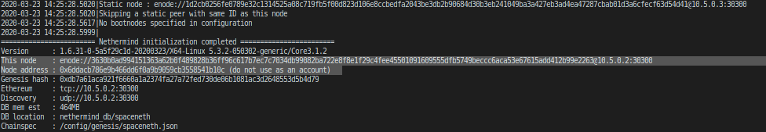

Tip: 

You can use ``Nethermind.Cli`` to fetch these values from nodes by executing the following:

::

    node.switch("http://localhost:8547")
    node.enode

9. the file should look similar to this:

::

    STATIC_NODE_1="enode://2281549869465d98e90cebc45e1d6834a01465a990add7bcf07a49287e7e66b50ca27f9c70a46190cef7ad746dd5d5b6b9dfee0c9954104c8e9bd0d42758ec58@10.5.0.2:30300"
    STATIC_NODE_2="enode://37878ec16a5ed87c9c80b4648e5428f5c768eddd79483be118319c49d11c4e535dac328b5216696cefe0792b7b64adc4de3aeb377550651e982590e62e5a500e@10.5.0.3:30300"
    STATIC_NODE_3="enode://6067f06d84c207e6233dacf1f3ef961bd7231f71d5425cbaf843cf19cfd5f7e13b024d234e4e5f6175bdb37c0bbccd14488b481b2280efb66d0631a20ae13ea3@10.5.0.4:30300"

10. copy & paste above variables into your terminal

11. for each node modify previously created empty ``static-nodes.json`` files by appending ``Enodes`` to them

::

    cat <<EOF > node_1/staticNodes/static-nodes.json
    [
        "$STATIC_NODE_1",
        "$STATIC_NODE_2",
        "$STATIC_NODE_3"
    ]
    EOF

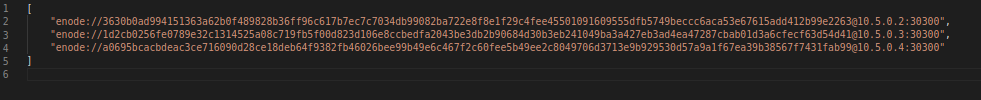

12. remove databases for each node

::

    sudo rm -rf node_1/db/spaceneth node_2/db/spaceneth node_3/db/spaceneth

13. run ``docker-compose`` file

::

    docker-compose up

You should see the private network working. We now need to send transactions in order to start producing blocks.

14. run ``Nethermind.Cli``

15. run ``node.switch("http://localhost:8547")``

16. run ``personal.listAccounts``

17. create new account ``personal.newAccount("test")``

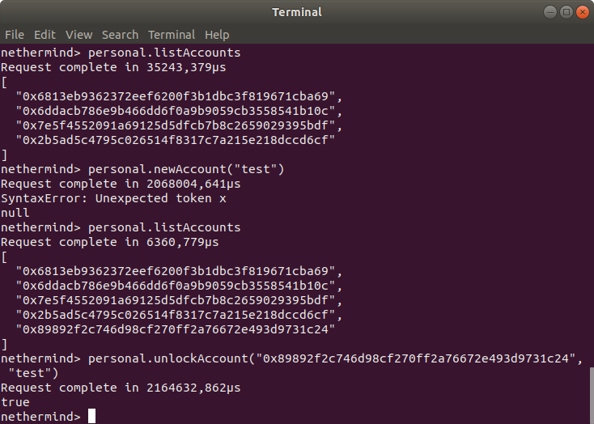

18. re-run ``personal.listAccounts`` and copy your account address

19. trigger blocks producing by sending transaction using ``eth_sendTransaction`` JSON RPC method. For example using ``curl``.
Change ``from`` property to your account address

::

    curl --data '{"jsonrpc":"2.0","method":"eth_sendTransaction","params":[{
        "from": "0x89892f2c746d98cf270ff2a76672e493d9731c24",
        "to": "0xe1ab8145f7e55dc933d51a18c793f901a3a0b276",
        "gas": "0x76c0",
        "gasPrice": "0x9184e72a000",
        "value": "0x9184e72a",
        "data": "0xd46e8dd67c5d32be8d46e8dd67c5d32be8058bb8eb970870f072445675058bb8eb970870f072445675"
    }],"id":0}' -H "Content-Type: application/json" -X POST localhost:8547

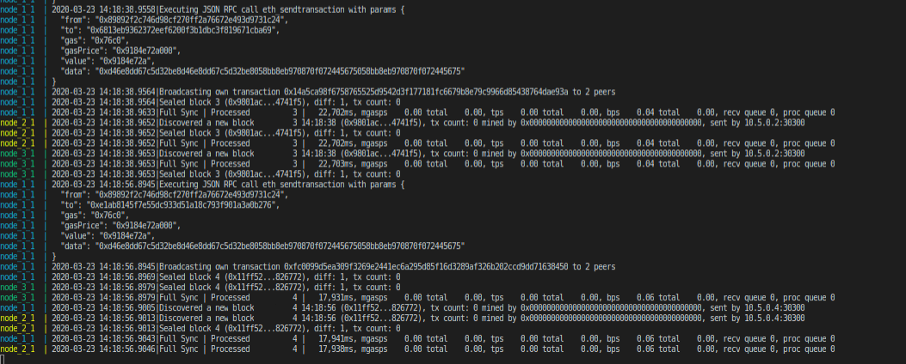

How to setup a Nethermind only AuRa based chain
====================================================

Prerequisites
^^^^^^^^^^^^^
* Linux bash shell
* Docker-compose
* Docker

::

    sudo apt-get install -y docker-compose docker.io

Setup
^^^^^

In this setup we will create a private network of 3 Nethermind nodes running a simple testing AuRa, an implementation of the Proof of Authority consensus algorithm.

1. create separate directory where we will store all files

::

    mkdir private-networking
    cd private-networking

2. create folders for each node and genesis

::

    mkdir node_1 node_2 node_3 genesis

3. download `chainspec <https://raw.githubusercontent.com/NethermindEth/nethermind/master/src/Nethermind/Chains/AuRaTest.json>`_ file with clique engine and place it in ``genesis`` folder.

::

    wget https://raw.githubusercontent.com/NethermindEth/nethermind/master/src/Nethermind/Chains/AuRaTest.json
    cp AuRaTest.json genesis/AuRaTest.json

4. create subfolders in each node folder

::

    mkdir node_1/configs node_1/staticNodes node_2/configs node_2/staticNodes node_3/configs node_3/staticNodes

5. create a ``static-nodes.json`` file and place it in node_1/staticNodes subfolders (do this for node_2 and node_3 as well)

::

    cat <<EOF > node_1/staticNodes/static-nodes.json
    [

    ]
    EOF

6. create ``config.cfg`` file and place it in ``node_1/configs`` subfolders (do this for node_2 and node_3 as well)

::

  cat <<EOF > node_1/configs/config.cfg
  {
    "Init": {
        "WebSocketsEnabled": false,
        "StoreReceipts" : true,
        "EnableUnsecuredDevWallet": true,
        "IsMining": true,
        "ChainSpecPath": "/config/genesis/AuRaTest.json",    
        "BaseDbPath": "nethermind_db/aura",
        "LogFileName": "AuraTest.logs.txt",
        "StaticNodesPath": "Data/static-nodes.json"
    },
    "Network": {
        "DiscoveryPort": 30300,
        "P2PPort": 30300,
        "LocalIp": "10.5.0.2",
        "ExternalIp": "10.5.0.2"
    },
    "JsonRpc": {
        "Enabled": true,
        "Host": "10.5.0.2",
        "Port": 8545
    },
    "KeyStoreConfig": {
        "TestNodeKey": "UYAHZEER1OTHOK1AUWUVAES0KAH3DAIM7AEG4OHHI8CHILAE0OOMUSILUNGOO5AE"
    },
    "Aura": {
        "ForceSealing": true,
        "AllowAuRaPrivateChains": true
    }
  }
  EOF

For each node you will need to change following items in configuration:

* ``LocalIp``, ``ExternalIp`` and ``Host`` should have the same value and be incremented for each node e.g. 10.5.0.3, 10.5.0.4 and so on and so forth.

.. image:: private-networking/configs-aura.png

7. copy ``docker-compose`` file and place it in working directory

::

  version: "3.5"
  services:

      node_1:
          image: nethermind/nethermind:alpine
          command: --config config
          volumes:
              - ./genesis:/config/genesis
              - ./node_1/configs/config.cfg:/nethermind/configs/config.cfg
              - ./node_1/staticNodes/static-nodes.json:/nethermind/Data/static-nodes.json
              - ./node_1/db/aura:/nethermind/nethermind_db/aura
              - ./node_1/keystore:/nethermind/keystore
          ports:
              - 0.0.0.0:8547:8545
          networks:
              vpcbr:
                  ipv4_address: 10.5.0.2

      node_2:
          image: nethermind/nethermind:alpine
          command: --config config
          volumes:
              - ./genesis:/config/genesis
              - ./node_2/configs/config.cfg:/nethermind/configs/config.cfg
              - ./node_2/staticNodes/static-nodes.json:/nethermind/Data/static-nodes.json
              - ./node_2/db/aura:/nethermind/nethermind_db/aura
              - ./node_2/keystore:/nethermind/keystore
          ports:
              - 0.0.0.0:8548:8545
          networks:
              vpcbr:
                  ipv4_address: 10.5.0.3

      node_3:
          image: nethermind/nethermind:alpine
          command: --config config
          volumes:
              - ./genesis:/config/genesis
              - ./node_3/configs/config.cfg:/nethermind/configs/config.cfg
              - ./node_3/staticNodes/static-nodes.json:/nethermind/Data/static-nodes.json
              - ./node_3/db/aura:/nethermind/nethermind_db/aura
              - ./node_3/keystore:/nethermind/keystore
          ports:
              - 0.0.0.0:8549:8545
          networks:
              vpcbr:
                  ipv4_address: 10.5.0.4

  networks:
      vpcbr:
          driver: bridge
          ipam:
              config:
                  - subnet: 10.5.0.0/16

8. run each node separately so that we can copy ``Enode`` and ``Node address`` for each node, we will use them later

::

    docker-compose run node_1

Stop the node when Nethermind initialization completes ``Ctrl +C``.
Copy ``This node`` and ``Node address`` values to a text file.
Continue with node_2 and node_3.

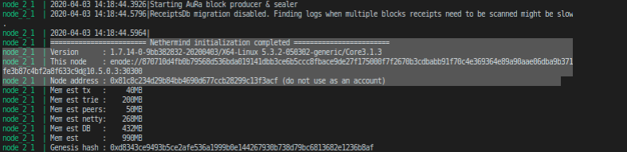

Tip: 

You can use ``Nethermind.Cli`` to fetch these values from nodes by executing the following:

::

    node.switch("http://localhost:8547")
    node.enode
    node.address

9. the file should look similar to this:

::

    NODE_ADDRESS_1="0x37db60ec32c212b0fe03904d3d1d70fb8dae8f1e"
    STATIC_NODE_1="enode://2281549869465d98e90cebc45e1d6834a01465a990add7bcf07a49287e7e66b50ca27f9c70a46190cef7ad746dd5d5b6b9dfee0c9954104c8e9bd0d42758ec58@10.5.0.2:30300"
    NODE_ADDRESS_2="0x81c8c234d29b84bb4690d677ccb28299c13f3acf"
    STATIC_NODE_2="enode://37878ec16a5ed87c9c80b4648e5428f5c768eddd79483be118319c49d11c4e535dac328b5216696cefe0792b7b64adc4de3aeb377550651e982590e62e5a500e@10.5.0.3:30300"
    NODE_ADDRESS_3="0xbedf7c017705c04a2c798a1f9c5059e10906c110"
    STATIC_NODE_3="enode://6067f06d84c207e6233dacf1f3ef961bd7231f71d5425cbaf843cf19cfd5f7e13b024d234e4e5f6175bdb37c0bbccd14488b481b2280efb66d0631a20ae13ea3@10.5.0.4:30300"

10. copy & paste above variables into your terminal

11. for each node modify previously created empty ``static-nodes.json`` files by appending ``Enodes`` to them

::

    cat <<EOF > node_1/staticNodes/static-nodes.json
    [
        "$STATIC_NODE_1",
        "$STATIC_NODE_2",
        "$STATIC_NODE_3"
    ]
    EOF

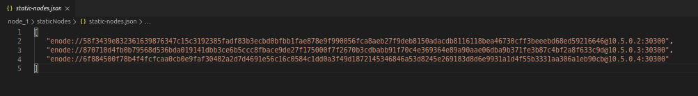

12. open ``genesis/AuraTest.json`` file and add previously saved ``Node addresses`` to validators list, leave stage 0 only

::

    "validators": {
    "multi": {
        "0" : {
            "list": ["0x37db60ec32c212b0fe03904d3d1d70fb8dae8f1e", "0x81c8c234d29b84bb4690d677ccb28299c13f3acf", "0xbedf7c017705c04a2c798a1f9c5059e10906c110"]
        },
    }

The file should then look like this:

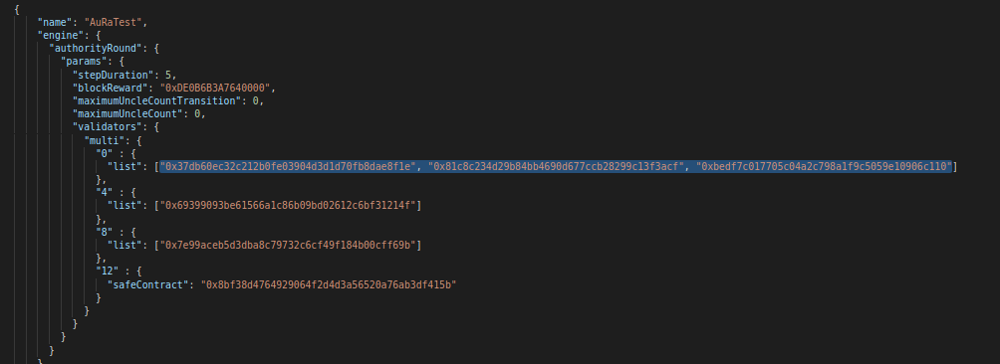

13. remove databases for each node

::

    sudo rm -rf node_1/db/aura node_2/db/aura node_3/db/aura

14. run ``docker-compose`` file

::

    docker-compose up

You should see the private network working, producing and sealing blocks.

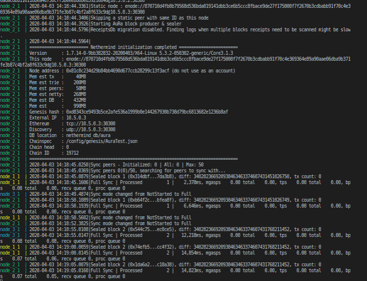
