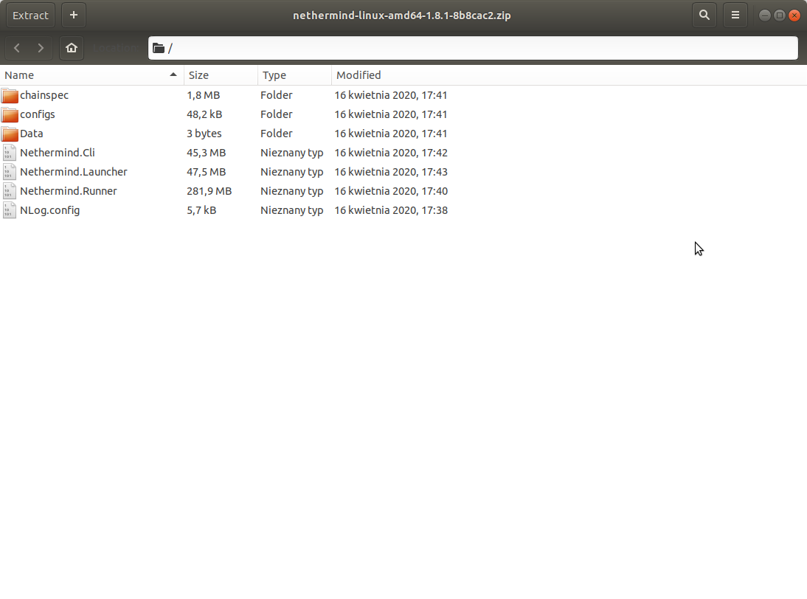

Runtime
*******

Directories
^^^^^^^^^^^

If you built the application locally then the entry point will be located in::

    src/Nethermind/Nethermind.Runner/bin/Release/netcoreapp3.1/

Log files by default are located in::

    src/Nethermind/Nethermind.Runner/bin/Release/netcoreapp3.1/logs

Database by default is located in::

    src/Nethermind/Nethermind.Runner/bin/Release/netcoreapp3.1/nethermind_db

NLog config
^^^^^^^^^^^
You can change the level of logging in file and in the console by choosing one of the levels (Error, Warn, Info, Debug, Trace)::

    <logger name="*" minlevel="Info" writeTo="file-async"/>
    <logger name="*" minlevel="Info" writeTo="auto-colored-console-async"/>

More detailed NLog configuration can be found `here <https://github.com/NLog/NLog/wiki/Configuration-file>`_.

Building from repository
------------------------------

Logging level can be controlled in NLog.config file located in::

    src/Nethermind/Nethermind.Runner/bin/Release/netcoreapp3.1/

Downloading package from Github/Downloads package
-------------------------------------------------

NLog.config file is supplied with the package and can be found in extraction directory.

Running Nethermind with docker image
------------------------------------

NLog.config file is located at ``/nethermind/NLog.config`` path inside the docker container.
The volume can be then mapped with a simple command::

    -v /home/user/NLog.config:/nethermind/NLog.config
