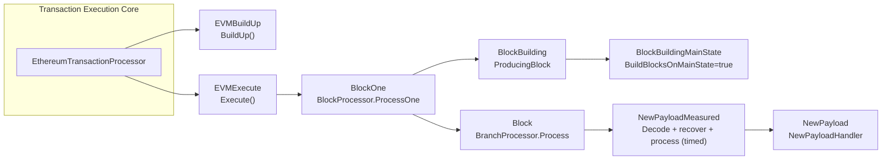
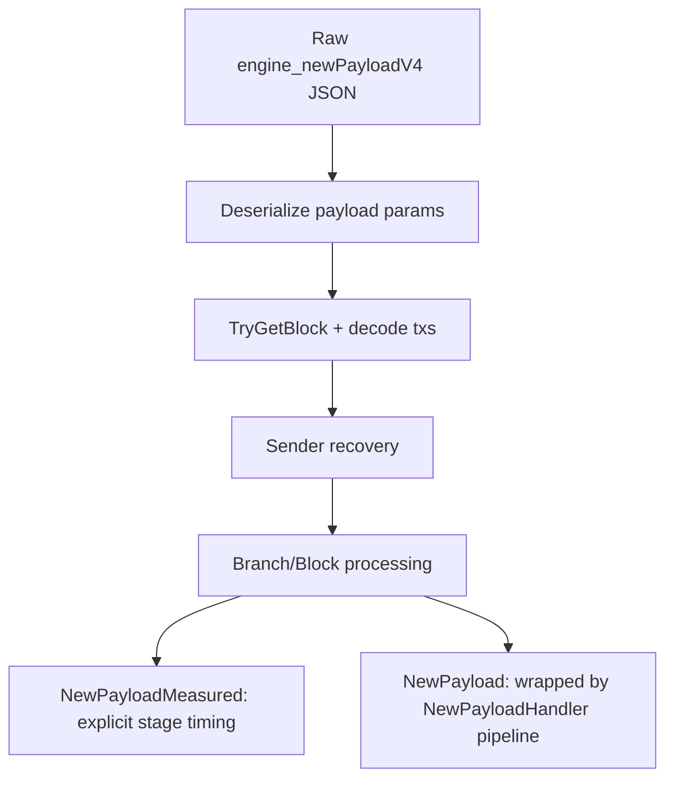
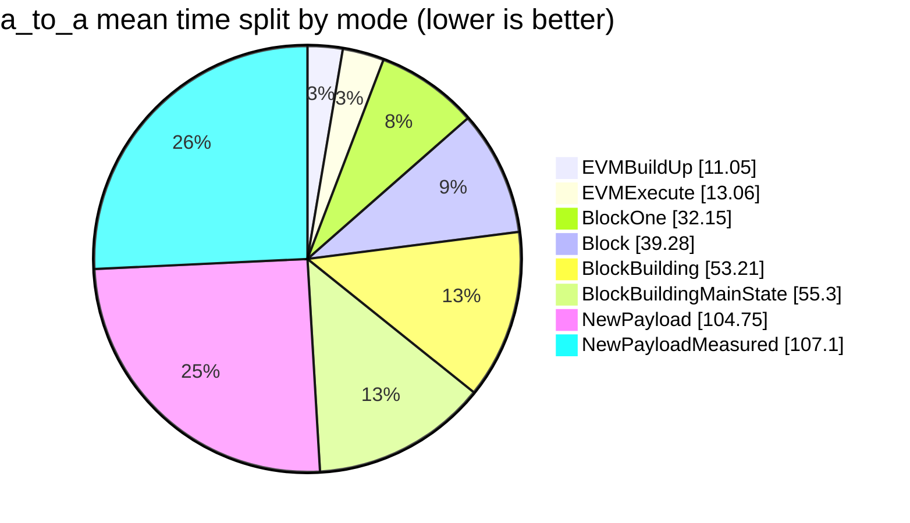

## Changes

This PR introduces the BenchmarkDotNet gas benchmark framework in Nethermind with mode-based coverage from direct transaction execution up to full `engine_newPayload` processing.

- Introduces EVM transaction execution modes.
- `--mode=EVMExecute`: tx execution via `TransactionProcessor.Execute` (import-like path).
- `--mode=EVMBuildUp`: tx execution via `TransactionProcessor.BuildUp` (block-building path).
- Introduces block processing modes.
- `--mode=BlockOne`: `BlockProcessor.ProcessOne`.
- `--mode=Block`: `BranchProcessor.Process`.
- Introduces block-building modes.
- `--mode=BlockBuilding`: producer-default behavior (`BuildBlocksOnMainState=false`, `ProcessingOptions.ProducingBlock`).
- `--mode=BlockBuildingMainState`: main-state producer behavior (`BuildBlocksOnMainState=true`).
- Introduces newPayload modes.
- `--mode=NewPayload`: `NewPayloadHandler` flow.
- `--mode=NewPayloadMeasured`: instrumented near-handler flow with detailed timing breakdown.
- Uses node-aligned processing defaults for `Block` and `BlockOne` (no forced `NoValidation | ForceProcessing`).
- Includes timing breakdown reporting with file output and console suppression for larger runs.

### Mode Architecture



### NewPayload vs Measured Flow



### What Each Mode Measures

| Mode | Benchmark class | Primary purpose | Includes |
|---|---|---|---|
| `EVMBuildUp` | `GasPayloadBenchmarks` | Block-building tx-path throughput | Tx execution via `BuildUp()` + state reset |
| `EVMExecute` | `GasPayloadExecuteBenchmarks` | Import-like tx-path throughput | Tx execution via `Execute()` + state reset |
| `BlockOne` | `GasBlockOneBenchmarks` | Direct block processing cost | `BlockProcessor.ProcessOne` |
| `Block` | `GasBlockBenchmarks` | Branch processing overhead | `BranchProcessor.Process` on top of BlockOne work |
| `BlockBuilding` | `GasBlockBuildingBenchmarks` | Producer path (default) | `ProducingBlock` options, producer transaction executor |
| `BlockBuildingMainState` | `GasBlockBuildingBenchmarks` | Producer on global/main state | Main-state config path |
| `NewPayload` | `GasNewPayloadBenchmarks` | Real handler path | JSON/payload checks + handler + queue + processing |
| `NewPayloadMeasured` | `GasNewPayloadMeasuredBenchmarks` | Detailed breakdown | Stage-level timings around decode/recovery/process |

## Benchmark Snapshot (2026-02-17)

Command shape used:
- `--inprocess --warmupCount 10 --iterationCount 10 --launchCount 1`

Scenario filters:
- `a_to_a`: `*a_to_a*` (matches 2 scenarios: `balance_0` and `balance_1`)
- `mulmod_63_bits`: `*opcode_MULMOD-mod_bits_63*`

### a_to_a (mean across 2 matched scenarios)

| Mode | Mean ms (avg) | MGas/s (avg) | Allocated |
|---|---:|---:|---:|
| `EVMBuildUp` | 11.05 | 9054.39 | 17.88 MB |
| `EVMExecute` | 13.06 | 7659.47 | 26.88 MB |
| `BlockOne` | 32.15 | 3114.70 | 34.02 MB |
| `Block` | 39.28 | 2547.67 | 53.2 MB |
| `BlockBuilding` | 53.21 | 1886.87 | 48.04 MB |
| `BlockBuildingMainState` | 55.30 | 1817.72 | 47.98 MB |
| `NewPayload` | 104.75 | 955.44 | 69.34 MB |
| `NewPayloadMeasured` | 107.10 | 933.49 | 69.32 MB |



### MULMOD mod_bits_63

| Mode | Mean ms | MGas/s | Allocated |
|---|---:|---:|---:|
| `BlockBuildingMainState` | 350.50 | 285.33 | 258.63 KB |
| `BlockOne` | 350.70 | 285.16 | 175.2 KB |
| `NewPayloadMeasured` | 354.10 | 282.44 | 198.76 KB |
| `BlockBuilding` | 358.30 | 279.07 | 259.68 KB |
| `EVMBuildUp` | 366.10 | 273.15 | 4.19 KB |
| `NewPayload` | 373.70 | 267.59 | 203.22 KB |
| `EVMExecute` | 375.10 | 266.60 | 5.69 KB |
| `Block` | 405.00 | 246.89 | 177.68 KB |

Note: for this scenario, one transaction consumes ~100M gas, so CPU time is dominated by opcode compute; allocation mostly reflects pipeline scaffolding, not opcode cost.

Artifacts:
- `BenchmarkDotNet.Artifacts/results/mode-verification-a_to_a-20260217-125034.csv`
- `BenchmarkDotNet.Artifacts/results/mode-verification-mulmod_63_bits-20260217-125250.csv`

## Files

| File | Purpose |
|---|---|
| `src/Nethermind/Nethermind.Evm.Benchmark/GasBenchmarks/GasPayloadBenchmarks.cs` | EVM BuildUp mode |
| `src/Nethermind/Nethermind.Evm.Benchmark/GasBenchmarks/GasPayloadExecuteBenchmarks.cs` | EVM Execute mode |
| `src/Nethermind/Nethermind.Evm.Benchmark/GasBenchmarks/GasBlockOneBenchmarks.cs` | BlockOne mode |
| `src/Nethermind/Nethermind.Evm.Benchmark/GasBenchmarks/GasBlockBenchmarks.cs` | Block mode |
| `src/Nethermind/Nethermind.Evm.Benchmark/GasBenchmarks/GasBlockBuildingBenchmarks.cs` | BlockBuilding + BlockBuildingMainState mode |
| `src/Nethermind/Nethermind.Evm.Benchmark/GasBenchmarks/GasNewPayloadBenchmarks.cs` | Handler-based NewPayload mode |
| `src/Nethermind/Nethermind.Evm.Benchmark/GasBenchmarks/GasNewPayloadMeasuredBenchmarks.cs` | Instrumented NewPayloadMeasured mode |
| `src/Nethermind/Nethermind.Evm.Benchmark/GasBenchmarks/BlockBenchmarkHelper.cs` | Shared setup/wiring for block-level modes |
| `src/Nethermind/Nethermind.Evm.Benchmark/Program.cs` | `--mode`, `--chunk`, diagnostic routing |

## Usage

```bash
# EVM execute path
dotnet run --project src/Nethermind/Nethermind.Evm.Benchmark -c Release -- --inprocess --mode=EVMExecute --filter "*MULMOD*"

# EVM buildup path
dotnet run --project src/Nethermind/Nethermind.Evm.Benchmark -c Release -- --inprocess --mode=EVMBuildUp --filter "*MULMOD*"

# Block import-like paths
dotnet run --project src/Nethermind/Nethermind.Evm.Benchmark -c Release -- --inprocess --mode=BlockOne --filter "*a_to_a*"
dotnet run --project src/Nethermind/Nethermind.Evm.Benchmark -c Release -- --inprocess --mode=Block --filter "*a_to_a*"

# Producer paths
dotnet run --project src/Nethermind/Nethermind.Evm.Benchmark -c Release -- --inprocess --mode=BlockBuilding --filter "*a_to_a*"
dotnet run --project src/Nethermind/Nethermind.Evm.Benchmark -c Release -- --inprocess --mode=BlockBuildingMainState --filter "*a_to_a*"

# NewPayload paths
dotnet run --project src/Nethermind/Nethermind.Evm.Benchmark -c Release -- --inprocess --mode=NewPayload --filter "*a_to_a*"
dotnet run --project src/Nethermind/Nethermind.Evm.Benchmark -c Release -- --inprocess --mode=NewPayloadMeasured --filter "*a_to_a*"
```

## Types of Changes

- [ ] Bugfix (a non-breaking change that fixes an issue)
- [x] New feature (a non-breaking change that adds functionality)
- [ ] Breaking change (a change that causes existing functionality not to work as expected)
- [x] Optimization
- [ ] Refactoring
- [x] Documentation update
- [x] Build-related changes
- [ ] Other: _Description_

## Testing

#### Requires testing

- [x] Yes
- [ ] No

#### If yes, did you write tests?

- [ ] Yes
- [x] No

#### Notes on testing

- Built benchmark project in Release.
- Ran all 8 modes on `a_to_a` and `mulmod_63_bits` with `--inprocess`.
- Verified mode routing for `BlockBuilding` and `BlockBuildingMainState`.
- Verified NewPayload breakdown output behavior (file output, console suppression policy).

## Documentation

#### Requires documentation update

- [x] Yes
- [ ] No

#### Requires explanation in Release Notes

- [ ] Yes
- [x] No

## Remarks

- Benchmark harness remains self-verifying on warmup for block-level correctness checks where applicable.
- New documentation replaces legacy ASCII diagrams with Mermaid for PR readability.
