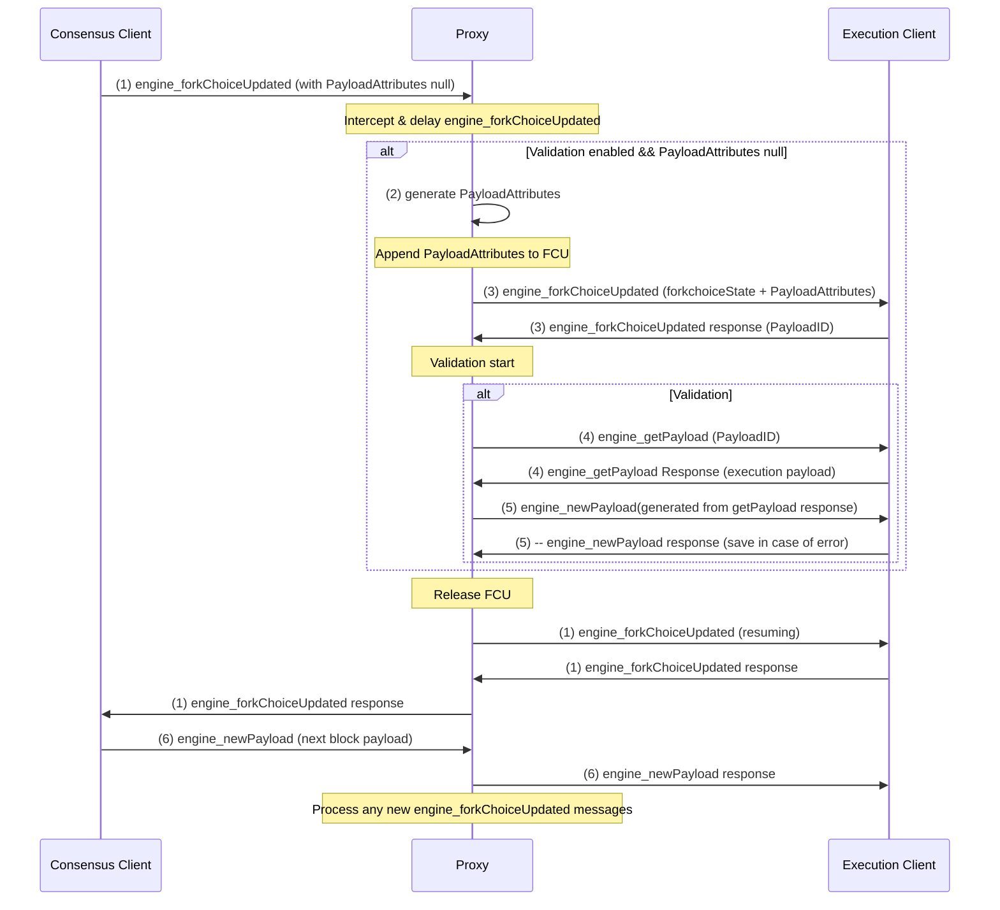

# Engine API Proxy

A proxy service that intercepts and modifies Consensus Layer requests to the Execution Layer, allowing for advanced request manipulation and sequencing.

## Overview

The Engine API Proxy sits between the Consensus Client (CC) and Execution Client (EC), intercepting Engine API calls. It implements a specific workflow for `engine_forkChoiceUpdated`, `engine_newPayload`, and `engine_getPayload` messages to ensure optimized processing sequence.

## Building

### From Source

```bash
# Clone the repository
git clone https://github.com/nethermindeth/nethermind.git

# Build the Engine API Proxy
cd tools/EngineApiProxy
dotnet build -c Release
```

### Using Docker

```bash
# Build the Docker image
docker build -f tools/EngineApiProxy/Dockerfile -t nethermindeth/engine-api-proxy:latest .
```

## Running

### Command-Line Options

- `--ec-endpoint` or `-e`: The URL of the execution client API endpoint (required)
- `--port` or `-p`: The port to listen for consensus client requests (default: 8551)
- `--log-level` or `-l`: Log level (Trace, Debug, Info, Warn, Error) (default: Info)
- `--validate-all-blocks`: Enable validation for all blocks, even those where CL doesn't request validation
- `--fee-recipient`: Default fee recipient address for generated payload attributes (default: 0x0000000000000000000000000000000000000000)

### Examples

#### Running from compiled binary

```bash
# Run with basic settings
dotnet run -c Release -- -e http://localhost:8551 -p 9551 -l Debug

# With full option names
dotnet run -c Release -- --ec-endpoint http://localhost:8551 --port 9551 --log-level Debug

# With auto-validation of all blocks enabled
dotnet run -c Release -- -e http://localhost:8551 -p 9551 --validate-all-blocks
```

#### Running with Docker

```bash
# Basic usage
docker run -p 9551:9551 nethermindeth/engine-api-proxy:latest -e http://execution-client:8551 -p 9551

# With auto-validation of all blocks enabled
docker run -p 9551:9551 nethermindeth/engine-api-proxy:latest -e http://execution-client:8551 -p 9551 --validate-all-blocks
```

## Configuration with Clients

### Consensus Client Configuration

Configure your Consensus Client to connect to the proxy instead of directly to the Execution Client:

```
# Example Lighthouse configuration
--execution-endpoint http://localhost:9551

# Example Prysm configuration
--execution-endpoint=http://localhost:9551
```

### Execution Client Configuration

No special configuration is needed for the Execution Client. The proxy will forward requests to the standard Engine API endpoint.

## Development

The project consists of several key components:

- `ProxyServer.cs`: Main HTTP server and request router
- `MessageQueue.cs`: Handles message queueing and processing
- `PayloadTracker.cs`: Tracks relationships between payloads and head blocks
- `BlockDataFetcher.cs`: Fetches block data from the execution client
- `PayloadAttributesGenerator.cs`: Generates valid payload attributes
- `RequestOrchestrator.cs`: Orchestrates the validation flow

### Message Flow

The proxy implements this workflow:



1. Intercept `engine_forkChoiceUpdated` requests
2. If auto-validation (`--validate-all-blocks`) is enabled and payload attributes are `null`:
   - Pause the message queue
   - Fetch block data for the head block
   - Generate valid payload attributes
   - Send modified FCU to EC with generated attributes
   - Get payload ID from FCU response
   - Make `engine_getPayload` request to EC
   - Generate synthetic `engine_newPayload` from payload and send to EC
   - TBD: write logs to specific file in case `engine_newPayload` returns an error
   - Resume message queue
3. Otherwise, forward request to EC as-is

### Concurrent forkChoiceUpdated Processing

## Auto-Validation Feature

The auto-validation feature allows the proxy to validate all blocks, including those where the Consensus Layer doesn't request validation (by sending null payload attributes). This is useful for:

- Testing consensus implementations
- Verifying block validation logic
- Forcing block creation for all forkChoiceUpdated calls
- Find issues with block validation logic

When enabled with `--validate-all-blocks`, the proxy will:

1. Detect FCU requests with null payload attributes
2. Generate valid payload attributes based on the current head block
3. Create and validate blocks (send `engine_getPayload` and `engine_newPayload` requests to EC)
4. Consensus Layer will not know about this, so it will proceed with the next block as usual

## Testing with Kurtosis

1.Build docker image

```bash
docker build -f tools/EngineApiProxy/Dockerfile -t nethermindeth/engine-api-proxy:latest .
```

2.Clone repository with kurtosis scripts

```bash
git clone https://github.com/dmitriy-b/ethereum-package.git
cd ethereum-package
git checkout feat/el-proxy
```

3.Install kurtosis CLI https://docs.kurtosis.com/install/#ii-install-the-cli 

4.Update `el-proxy.yaml` with correct execution client endpoint

```
participants:
  - el_type: nethermind
    cl_type: lighthouse
    snooper_enabled: false
    # el_proxy_enabled: true
  - el_type: nethermind
    cl_type: lighthouse
    validator_count: 0
    use_separate_vc: true
    snooper_enabled: false
    el_proxy_enabled: true
```

Note: there should be at least 2 nodes with one validator. `el_proxy_enabled: true` should be set for one of them (not validator one) and `snooper_enabled` should be set to `false` for it.

5.Run kurtosis stack

```bash
kurtosis run . --args-file .github/tests/el-proxy.yaml --enclave testnet
```

6.Using hte script find out IP addresses and ids of cl, el and proxy containers 

```bash
python3 tools/EngineApiProxy/Scripts/inspect_containers.py 
```

You will get output like this:

```
Container Name: vc-1-nethermind-lighthouse--f65236fe1ca847219d06743d1b27b254
Container ID: 0ad50ac1ddd8
IP Address: 172.16.0.14
Beacon Nodes: http://172.16.0.12:4000
----------------------------------------
Container Name: cl-2-lighthouse-nethermind--c30ffb94d23b491cb74937b55098d3a2
Container ID: aad9e7a6f2c2
IP Address: 172.16.0.13
Execution Endpoints: http://172.16.0.11:9551
----------------------------------------
Container Name: cl-1-lighthouse-nethermind--22f7e291c6cb42ecaee2b288ae51ce04
Container ID: e86a6dd5b8e3
IP Address: 172.16.0.12
Execution Endpoints: http://172.16.0.9:8551
----------------------------------------
Container Name: el-proxy-2-nethermind--40c3d946b41f4b14ab4f34569d17a3cc
Container ID: 00cf58fd8a86
IP Address: 172.16.0.11
Transformed Args:
  EC_ENDPOINT: http://172.16.0.10:8551
  PORT: 9551
  VALIDATE_ALL_BLOCKS: None
  LOG_LEVEL: Info
----------------------------------------
Container Name: el-2-nethermind-lighthouse--f7905805d6804fee83796f14c9c228a4
Container ID: 1f4a966091ad
IP Address: 172.16.0.10
----------------------------------------
Container Name: el-1-nethermind-lighthouse--c43ec163f1b04c569d9bf4e49995ce32
Container ID: d43416e2d209
IP Address: 172.16.0.9
```

7.Check logs of proxy container

```bash
docker logs el-proxy-2-nethermind--40c3d946b41f4b14ab4f34569d17a3cc > proxy.txt
```

8.Check logs of consensus client

```bash
docker logs cl-1-lighthouse-nethermind--22f7e291c6cb42ecaee2b288ae51ce04 > consensus.txt
```

## Troubleshooting

- Set log level to debug and check proxy logs for detailed information. Debug level can be set here https://github.com/dmitriy-b/ethereum-package/blob/4e3ca6d6b594a1e08c1b7441337256fd1cb01874/src/el-proxy/el_proxy_launcher.star#L56 
- Verify connectivity to both the Consensus Client and Execution Client
- Ensure the execution client endpoint URL is correctly formatted and accessible
- If using auto-validation, check that block data is being fetched successfully
- Using `tools/EngineApiProxy/Scripts/inspect_containers.py` script you can find out IP addresses and configuration of the proxy container
