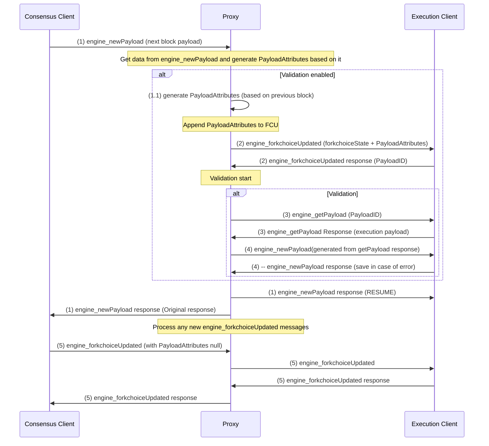
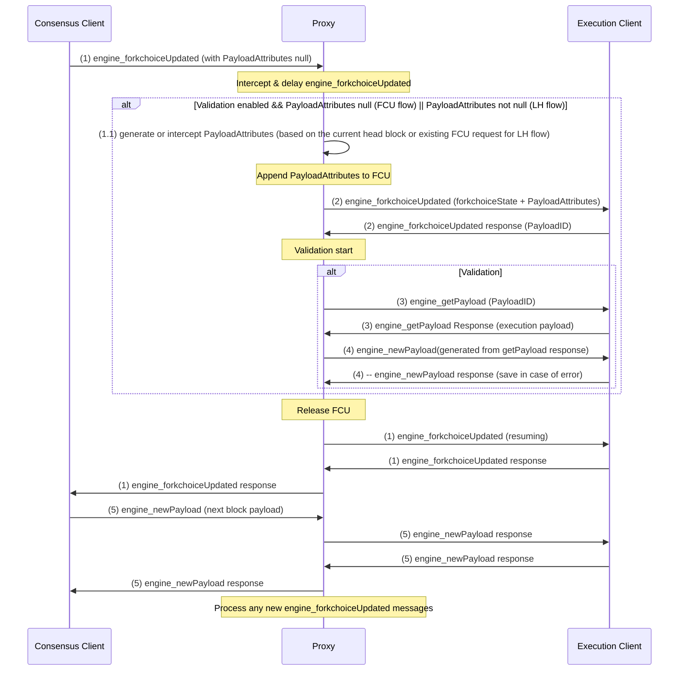

# Engine API Proxy

A proxy server that sits between Consensus Layer (CL) and Execution Layer (EL) clients to intercept and enhance Engine API messages.

## Overview

The Engine API Proxy sits between the Consensus Client (CC) and Execution Client (EC), intercepting Engine API calls. It implements a specific workflow for `engine_forkchoiceUpdated`, `engine_newPayload`, and `engine_getPayload` messages to ensure optimized processing sequence.

## Building

### From Source

```bash
# Clone the repository
git clone https://github.com/nethermindeth/nethermind.git

# Build the Engine API Proxy
cd tools/EngineApiProxy
dotnet build -c Release
```

### Using Docker

```bash
# Build the Docker image
docker build -f tools/EngineApiProxy/Dockerfile -t nethermindeth/engine-api-proxy:latest .
```

## Validation Flows

The proxy supports four validation modes:

1. **FCU Mode**: Validates through the ForkChoiceUpdated pipeline
2. **NewPayload Mode**: Validates through the NewPayload pipeline
3. **Merged Mode**: Validates through the ForkChoiceUpdated pipeline and stores PayloadID without validation, and validation happens at next new_payload request
4. **LH Mode**: Similar to Merged, but intercepts PayloadAttributes from existing FCU requests instead of generating them

Note: for LH mode we should use Lighthouse consensus client with `--always-prepare-payload` flag enabled. At the moment LH mode is the most accurate validation mode.

## Configuration

Key configuration options:

- **ValidationMode**: FCU, NewPayload, Merged, LH
- **ValidateAllBlocks**: Whether to validate all blocks or only specific ones
- **DefaultFeeRecipient**: The default fee recipient address to use when generating payload attributes
- **TimestampOffsetSeconds**: The time offset in seconds for block timestamp calculation
- **RequestTimeoutSeconds**: The timeout in seconds for HTTP requests to EL/CL clients
- **ExecutionClientEndpoint**: The URL of the execution client
- **ListenPort**: The port on which the proxy listens for requests
- **GetPayloadMethod**: The method to use when getting payloads for validation
- **NewPayloadMethod**: The method to use when sending new payloads for validation

## Usage

```bash
dotnet run --project tools/EngineApiProxy -- --ec-endpoint http://localhost:8551 --listen-port 9551
```

## Running

### Command-Line Options

- `--ec-endpoint` or `-e`: The URL of the execution client API endpoint (required)
- `--cl-endpoint` or `-c`: The URL of the consensus client API endpoint (optional)
- `--port` or `-p`: The port to listen for consensus client requests (default: 8551)
- `--log-level` or `-l`: Log level (Trace, Debug, Info, Warn, Error) (default: Info)
- `--validate-all-blocks`: Enable validation for all blocks, even those where CL doesn't request validation
- `--fee-recipient`: Default fee recipient address for generated payload attributes (default: 0x0000000000000000000000000000000000000000)
- `--validation-mode`: Mode for block validation (Fcu or NewPayload) (default: NewPayload)
- `--get-payload-method`: Engine API method to use when getting payloads for validation (default: engine_getPayloadV4)
- `--new-payload-method`: Engine API method to use when sending new payloads for validation (default: engine_newPayloadV4)

### Examples

#### Running from compiled binary

```bash
# Run with basic settings
dotnet run -c Release -- -e http://localhost:8551 -p 9551 -l Debug

# With Consensus Client endpoint for direct CL data access
dotnet run -c Release -- -e http://localhost:8551 -c http://localhost:4000 -p 9551

# With full option names
dotnet run -c Release -- --ec-endpoint http://localhost:8551 --port 9551 --log-level Debug --cl-endpoint http://localhost:4000

# With auto-validation of all blocks enabled
dotnet run -c Release -- -e http://localhost:8551 -p 9551 --validate-all-blocks

# Using Fcu validation mode instead of NewPayload
dotnet run -c Release -- -e http://localhost:8551 -p 9551 --validate-all-blocks --validation-mode Fcu

# Using a specific engine_getPayload version
dotnet run -c Release -- -e http://localhost:8551 -p 9551 --get-payload-method engine_getPayloadV3

# Using specific payload method versions
dotnet run -c Release -- -e http://localhost:8551 -p 9551 --get-payload-method engine_getPayloadV3 --new-payload-method engine_newPayloadV3
```

#### Running with Docker

```bash
# Basic usage
docker run -p 9551:9551 --network=sedge-network nethermindeth/engine-api-proxy:latest -e http://execution-client:8551 -p 9551

# With auto-validation of all blocks enabled
docker run -p 9551:9551 nethermindeth/engine-api-proxy:latest -e http://execution-client:8551 -p 9551 --validate-all-blocks

# Using specific payload method versions and a specific engine_getPayload version
docker run -p 9551:9551 nethermindeth/engine-api-proxy:latest -e http://execution-client:8551 -p 9551 --get-payload-method engine_getPayloadV3 --new-payload-method engine_newPayloadV3
```

## Consensus Client Integration

When a consensus client endpoint is configured using the `--cl-endpoint` or `-c` parameter, the proxy can directly fetch data from the consensus client. This enables additional features and provides access to beacon chain data.

## Configuration with Clients

### Consensus Client Configuration

Configure your Consensus Client to connect to the proxy instead of directly to the Execution Client:

```
# Example Lighthouse configuration
--execution-endpoint http://localhost:9551
```

### Execution Client Configuration

No special configuration is needed for the Execution Client. The proxy will forward requests to the standard Engine API endpoint.

## Auto-Validation Feature

The auto-validation feature (`--validate-all-blocks`) allows the proxy to validate all blocks, including those where the Consensus Layer doesn't request validation (by sending null payload attributes).

### Validation Flow

Validation flow allows to generate validation events (FCU -> GetPayload -> NewPayload) for blocks that were validated by another consensus client.

It might be useful in the following cases:

1. To make sure that execution client is able to build a valid block that another consensus client already validated
2. Catch and log bad blocks as soon as possible
3. Testing consensus implementations
4. Debug issues with block validation logic (TBD)

When enabled with `--validate-all-blocks`, the proxy will:

1. Detect FCU requests with null payload attributes
2. Generate valid payload attributes based on the current head block
3. Create and validate blocks (send `engine_getPayload` and `engine_newPayload` requests to EC)
4. Consensus Layer will not know about this, so it will proceed with the next block as usual

The tool did not modify existing blockchain and can be safely used in the production environment. But it is highly recommend to use `--validate-all-blocks` flag to enable the validation only on nodes that are not validator ones.

There are 4 flows of validation:

1. Validation after `engine_newPayload` request (`--validation-mode=NewPayload` or `--validation-mode=Merged`)

In this flow CL sends `engine_newPayload` request to the proxy, proxy generates payload attributes based on the payload and sends `engine_forkChoiceUpdated` request to the execution client with payload attributes. Then EL will return PayloadID and proxy will use it to send `engine_getPayload` request to the execution client. After that proxy will generate synthetic `engine_newPayload` request and send it to the execution client.

With the flow, we will generate FCU based on the parent block, so the final "validated" block may be different from the original one. Since we hold `engine_newPayload` request and do not control FCU, flow will run against all `engine_newPayload` requests, so this may break validator node.

#### NewPayload Flow



2.Validation of payloads based on `engine_forkchoiceUpdated` request (`--validation-mode=Fcu` or `--validation-mode=LH`)

The difference between this flow is that we are not waiting for `engine_newPayload` request from CL, but only for `engine_forkchoiceUpdated` with null payload attributes. The validation payload should be very close to the original one (since we are using the same `forkchoiceState`), but with different `blockHash` and `blockNumber`.

The flow may be safely used with both validator and non-validator nodes, since we are ignoring FCU requests when payload attributes are not null.

With LH mode we are not generating PayloadAttributes, but intercepting them from the existing FCU request.

#### FCU Flow



#### Differences between FCU and NewPayload flows

- they block (and then resume) different requests (`engine_forkchoiceUpdatedV3` vs `engine_newPayload`)
- in FCU flow payload we have already the payload we need to validate, in newPayload flow we need to generate it based on current state
- in FCU flow `engine_forkchoiceUpdatedV3` will be generated using `latestValidHash` from the current `engine_newPayload` request (because EL already has this block), in NewPayload flow we will use `latestValidHash` from the previous block (since current block is not exist in EL DB yet)
- thus, we may have different payloads in FCU and NewPayload flows, but FCU one will be more close to the original one
- in FCU we start validation only if we have null payload attributes, in NewPayload we will validate every payload (since there is no way to know if the payload was already validated by another CL before `engine_newPayload` request was sent)
- in LH mode we are not generating PayloadAttributes, but intercepting them from the existing FCU request.

## Testing with Kurtosis

1.Build docker image

```bash
docker build -f tools/EngineApiProxy/Dockerfile -t nethermindeth/engine-api-proxy:latest .
```

2.Clone repository with kurtosis scripts

```bash
git clone https://github.com/dmitriy-b/ethereum-package.git
cd ethereum-package
git checkout feat/el-proxy
```

3.Install kurtosis CLI https://docs.kurtosis.com/install/#ii-install-the-cli 

4.Update `el-proxy.yaml` with correct execution client endpoint

```
participants:
  - el_type: nethermind
    cl_type: lighthouse
    snooper_enabled: false
    # el_proxy_enabled: true
  - el_type: nethermind
    cl_type: lighthouse
    validator_count: 2
    use_separate_vc: true
    snooper_enabled: false
    el_proxy_enabled: true
    blobber_enabled: true
    blobber_extra_params:
      - --proposal-action-frequency=1
      - "--proposal-action={\"name\": \"blob_gossip_delay\", \"delay_milliseconds\": 3000}"

# Global settings - default for participants without explicit el_proxy_enabled
snooper_enabled: false
el_proxy_enabled: false

additional_services:
  - spamoor
```

Note: there should be at least 2 nodes with one validator. `el_proxy_enabled: true` should be set for one of them (not validator one) and `snooper_enabled` should be set to `false` for it. LH mode is used by default (`--always-prepare-payload` flag enabled in Lighthouse consensus client). To test blob transactions, you need to set `blobber_enabled: true`, `blobber_extra_params` to the correct values and use `spamoor` service.

5.Run kurtosis stack

```bash
kurtosis run . --args-file .github/tests/el-proxy.yaml --enclave testnet
```

## Issues and Limitations

- Following message in EL logs:
  ```txt
  sedge-execution-client  | 10 Apr 16:05:25 | Non consecutive block commit. This is likely a reorg. Last block commit: 158346. New block commit: 158346.
  ```
  This is an expected and happens because we do not send FCU after the validation. So, CL doesn't not know about the block and we revert it on the EL side

## Troubleshooting

- Set log level to debug and check proxy logs for detailed information. Debug level can be set here https://github.com/dmitriy-b/ethereum-package/blob/4e3ca6d6b594a1e08c1b7441337256fd1cb01874/src/el-proxy/el_proxy_launcher.star#L56 
- Verify connectivity to both the Consensus Client and Execution Client
- Ensure the execution client endpoint URL is correctly formatted and accessible
- If using auto-validation, check that block data is being fetched successfully
- "2025-04-11 14:56:38.2485|WARN|Validation flow failed, payloadId is empty. Seems like the node is not synced yet. " - this is expected and happens when CL is not synced yet. To check sync status do:

  ```
  curl -X GET "http://localhost:4000/eth/v1/node/syncing" -H "Accept: application/json"
  ```