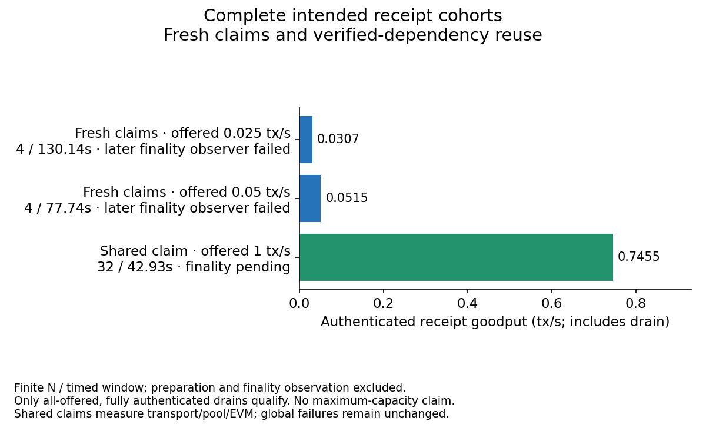
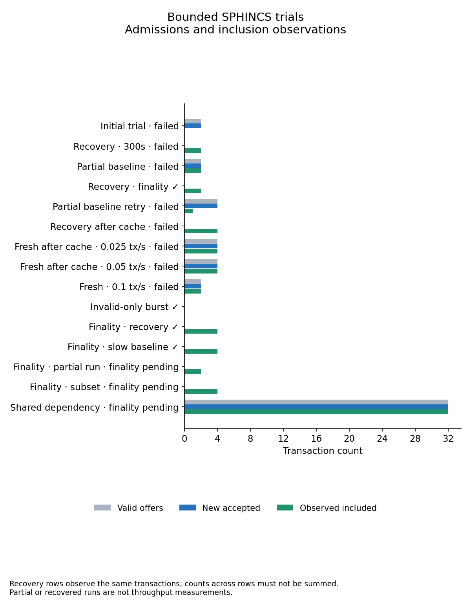
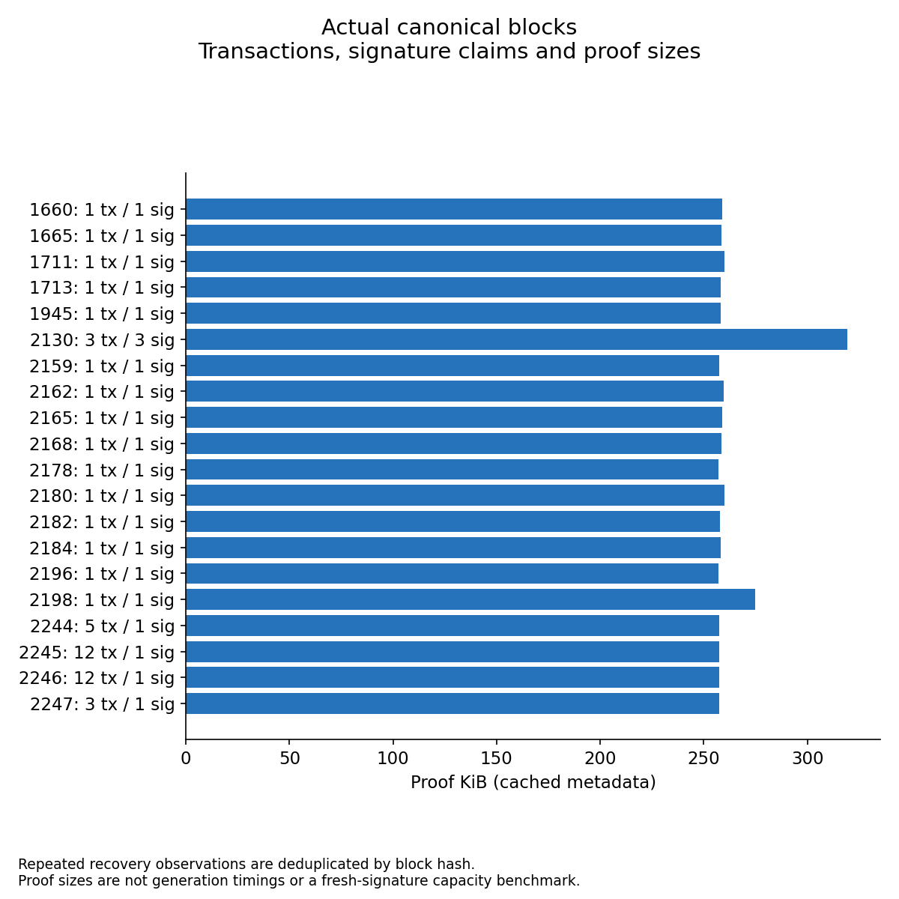

# Bounded SPHINCS load, failures and recovery

Real two-EL/two-Lighthouse data captured at 2026-10-03 22:58 UTC. This is an exploratory small-cohort load test, not a maximum-capacity benchmark. The [driver guide](../../../README.md) covers fixture preparation, bounds and passive finality checks.

| Original run | New accepted / intended | Receipt drain | Original outcome |
| --- | ---: | --- | --- |
| Initial 0.1 tx/s attempt | 2 / 8 | Observer failed | EL2 OOM, exit 137, memory limit 2,048,000,000 bytes. |
| Incomplete baseline | 2 / 8 | 2 authenticated | Health REST timeout; Engine production also logged a null-reference fault. |
| Coherent `320950` retry | 4 / 8 | Only 1 before deadline | Fifth negative probe was Busy; its valid transaction was not offered. Health polling and receipt drain then timed out. |
| Fresh 0.025 tx/s | 4 / 4 | 4 authenticated | Drain succeeded; later finality REST observer failed. |
| Fresh 0.05 tx/s | 4 / 4 | 4 authenticated | Drain succeeded; later finality REST observer failed. |
| Fresh 0.1 tx/s | 2 / 8 | 2 authenticated | Health REST timeout stopped offers. No complete rate point. |
| Shared claim, 1 tx/s | 32 / 32 | 32 authenticated | Healthy drain; finality observation pending in this snapshot. |
| Invalid-only | 0 valid offers | Sender nonces unchanged | 32 `proofRejected`, zero Busy/unexpected; eight negative templates repeated four times. |

The original failures remain `completed=false`. Separate passive recovery observers authenticate canonical receipts, Core commitments, beacon bids and finalized checkpoints without new offers or combining timing windows. The first recovery's 300-second deadline expired; its later observation finalized both transactions. Post-deployment recovery authenticated all four accepted retry transactions with **zero replay submissions**. Its later passive finality observer and the 0.025 observer have completed; the 0.05 and partial 0.1 finality observers are pending in this snapshot. Recovery counts repeat original transactions and must not be summed.

The initial OOM lost pending nonce 4; it was manually replayed exactly once, with nonce 3 never resubmitted. That replay is recovery, excluded from fresh-load throughput. An earlier launcher failed before submitting because sibling `drive.py` was missing; its overwritten startup log is not archived. Both ELs were subsequently raised to 5 GiB. Immutable old deployment and coherent `320950` hashes remain separate from final `d96ae0c9134a` managed hashes; the native library remained `d7c7edff…0a7e6`, ABI4. The fresh 0.025, 0.05, partial 0.1 and shared runs used both ELs on final `d96`.

## Authenticated receipt goodput



The graph retains the original **N / timedRunSeconds** only when every intended valid offer and the complete receipt drain are authenticated, with no arrival/drain stop. It does not turn a later finality observer failure into a completed test. The 0.025 and 0.05 points are 0.030735 and 0.051453 tx/s; the shared point is 0.745453 tx/s over 42.9269 seconds. Small finite cohorts have only N−1 interarrival gaps; N/window can exceed the offered cadence. Preparation and passive finality are excluded. No maximum-capacity claim is made.

Shared load reused already-authenticated claim 113 from nonce 11. All 32 signed transactions had distinct nonces 21–52; this measures transport/pool/EVM goodput with one verified dependency, **not fresh-signature capacity**. Its four blocks contained 5/12/12/3 transactions, each with one unique claim and a 263,712-byte proof. Repeated negative templates may hit cached rejections; 32 RPC outcomes do not imply 32 native verifications.

## Outcomes and actual blocks



[Stage CSV](stages.csv) keeps original completion, receipt-goodput eligibility and finality state separate. Recovery rows are observations only. Historical `f600` interarrival metrics use pre-negative-probe cycle starts, labelled as such in the export; the tracked driver now records actual valid-wrapper RPC-start timestamps. Historical values are not rewritten. Receipt count/window measurements are unaffected.



[Block CSV](blocks.csv) deduplicates recovery observations by canonical hash. Recovered nonces 8–10 share block 2130, slot 2191, with three distinct signature claims and a 327,016-byte proof. This is real block aggregation evidence, not a fresh-load rate point. EL1 produced it on `d96`; EL2 imported it before its upgrade. The log records a 72.51 ms candidate, which does not isolate native proving or prove a cache hit; an already verified parent may contribute. The timeout diagnostic records bounded REST failures without establishing an exact scheduler, lock or prover cause.

## Data and reproduction

[evidence.json.gz](evidence.json.gz) contains selected values, exact report/source hashes, receipt identities, block dependency counts, cached proof sizes/commitments, sampled resources and bounded diagnostics. [Checksums](evidence.sha256) cover compressed and decompressed bytes. Historical proof metadata is an explicit archived snapshot with source report hashes, not fresh proof generation. Runner RSS high-water marks are lifetime process peaks, not isolated-stage or native-only measurements; samples can miss brief peaks.

[Helper provenance](helper-provenance.json) identifies the tool and source hashes. The actual later capture driver is archived in [bounded-driver-f600.py.gz](bounded-driver-f600.py.gz), and the earlier coherent retry driver in [fresh-load-driver.py.gz](fresh-load-driver.py.gz). Earlier uncommitted driver versions were not archived; their exact report hashes remain. No fixture, full payload, proof binary or JWT is committed.

```sh
python3 tools/LeanBench/devnet/capture_spam.py --runtime-root=<devnet-root>/runtime > evidence.json
gzip -n evidence.json
python3 tools/LeanBench/devnet/plot_spam.py --input=evidence.json.gz --out=<capture-directory>
```

Plotting requires Matplotlib and writes mobile PNGs plus readable CSVs. Later data-only finality updates preserve the original failed reports and timing windows.
