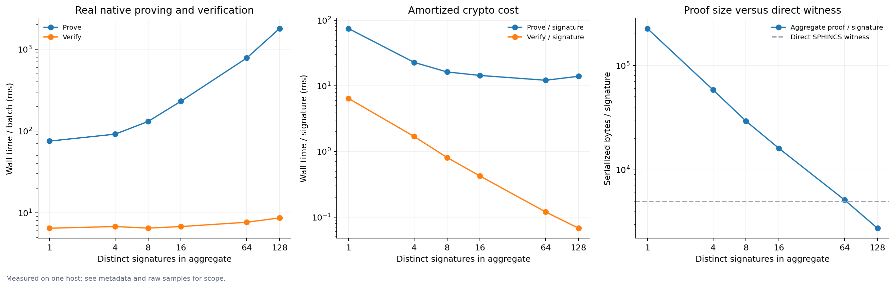
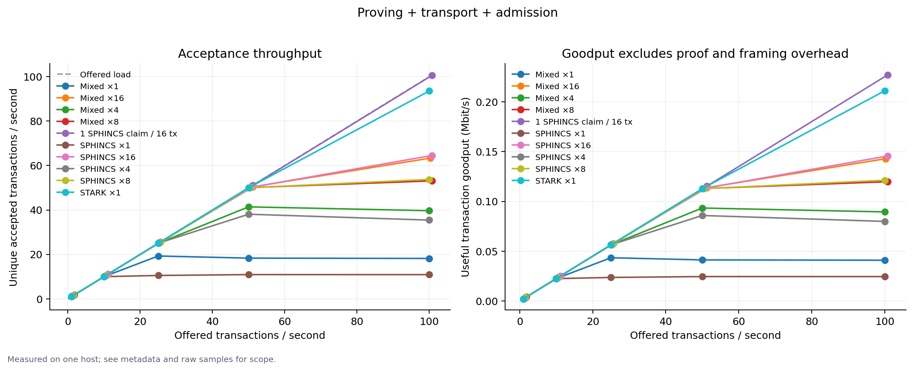
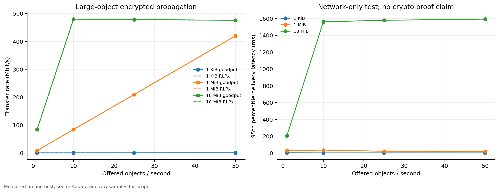

# Measured Lean/devp2p baseline

Measured on an Apple M2 Max, 32 GiB RAM, macOS 15.7.4, .NET 10.0.9. Source revision:
`0be54dfd4cab51628ce8e4067a74aa14c1d02c9b`. These measurements precede the expanded
EIP-8250/8272/7906 prototype composition and ABI-3 resource hardening; they do not
measure later changes.
Archived protocol rows used a `Task.Run` scheduler stand-in, omitting production scheduler capacity, deadlines and block-processing cancellation. Full/load/protocol percentiles used `sorted[ceil((count - 1) * p)]`; current runs use nearest-rank. Captured values remain unchanged.

Each summary records the exact command, native/backend revision and compiled binary
SHA-256 hashes. Original results-file hashes identify the complete sample datasets.

The [harness instructions](../../README.md) describe fresh distinct claims, sixteen
SPHINCS keys, real native cryptography, production codecs over localhost TCP, bounded
queues, actual pool admission and CPU accounting. This is a local baseline, not WAN
or block-execution throughput. Generic proofs are generated before timing; generic
envelope assembly reverifies and carries them, without recursive compression.
The measured TCP path feeds codecs directly and bypasses `PacketSender`; it does
not benchmark the later mixed-traffic deferred-send queue or receive-byte budget.

## Proving and aggregation

Three warmups and five measured batches per case. Means from [full results](full/results.csv):

| Distinct signatures | Prove ms/batch | Verify ms/batch | Proof bytes/batch |
| ---: | ---: | ---: | ---: |
| 1 | 75.25 | 6.46 | 225,798 |
| 4 | 91.48 | 6.78 | 232,917 |
| 8 | 130.79 | 6.48 | 234,443 |
| 16 | 231.31 | 6.77 | 257,198 |
| 64 | 781.36 | 7.65 | 328,885 |
| 128 | 1,796.41 | 8.64 | 352,725 |

At 128 signatures the proof is about 44% smaller than 128 direct 4,956-byte witnesses.
At 64 signatures it remains slightly larger. Small aggregates primarily amortize
verification; they do not save witness bytes with this pinned backend.

## Sustained offered load

The full matrix contains 80 rows: 12 crypto, 50 proving/transport/admission loads,
six preproved protocol loads and 12 object transport loads. Load rows offer traffic
for ten seconds and include queue drain in their throughput denominator. Every
independent row uses fresh claims; no transaction pool admission rejected a valid
measured transaction. Saturation losses are explicit bounded-queue drops.

At 100 offered transactions/s, distinct-signature proving plus transport/admission
achieved 10.90/35.44/53.76/64.56 unique transactions/s for batches of 1/4/8/16.
The shared-signature control achieved 100.63 transactions/s; it measures transaction
body throughput and cannot be compared as distinct-signature proving capacity.

## Preproved bursts

These separate datasets exclude proof preparation from timed receive capacity.
Schedule lateness remains part of accepted-batch latency. Sender pacing and latest
pending replacement are reported independently; scheduled rate is not realized
wire arrival rate.

| Case | Scheduled tx | Send seconds | Realized offer tx/s | Accepted tx | Accepted tx/s | Latest replacements | Preparation seconds |
| --- | ---: | ---: | ---: | ---: | ---: | ---: | ---: |
| SPHINCS 1 | 2,000 over 2s | 9.305 | 214.93 | 1,013 | 108.68 | 987 | 160.75 |
| SPHINCS 16 | 2,000 over 2s | 1.989 | 1,000.00 | 2,000 | 999.32 | 0 | 31.60 |
| Generic STARK 1 | 1,000 over 1s | 3.590 | 278.56 | 594 | 165.09 | 406 | 3.70 |

No pool admission rejects occurred. Raw rows and provenance are in
[SPHINCS burst](protocol-burst/results.csv) and
[generic burst](protocol-burst-stark/results.csv).

## Large objects

Random incompressible objects traverse production Snappy/AES/MAC RLPx framing over
localhost TCP. The 10 MiB case saturated at roughly 476–480 Mbit/s of exact delivered
payload (about 57 MiB/s), with bounded-queue drops at higher offered object rates.
1 MiB objects sustained all 50 offered objects/s, about 419 Mbit/s. Wire bytes count
encoded RLPx data and exclude TCP/IP overhead. Useful transaction goodput in the
other graphs excludes proof/wrapper bytes.

Each directory includes a summary (`full/summary.json.gz` for the large capture) and unmodified `results.csv`. The shared
[fixture-generation cost CSV](fixture-generation.csv) records client proving costs. The original full JSON and per-batch samples were
retained outside the repository; the summaries retain all measured rows and
original file hashes. No figures contain modeled or synthesized data.
