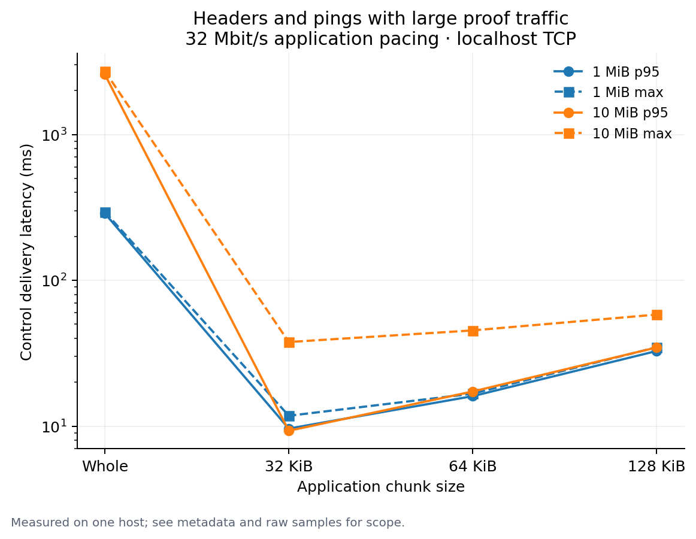
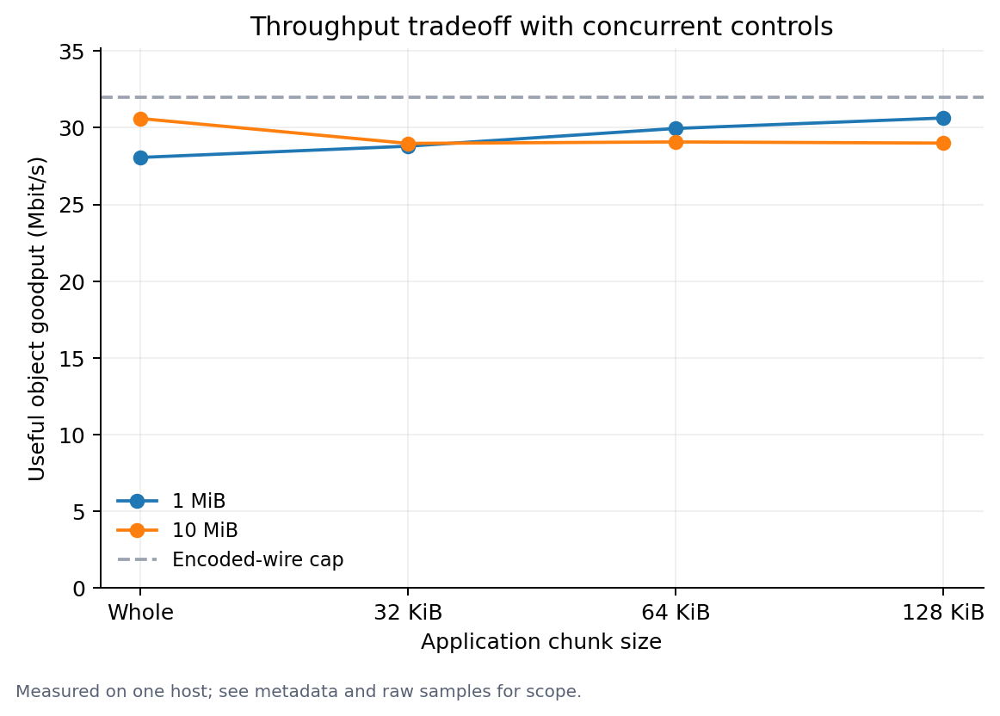

# Chunked proof traffic over RLPx

Measured on 2026-10-03, Apple M2 Max / 32 GiB RAM, .NET 10. Three sequential transfers per row, 24 rows, 2,407 delivered control probes, zero control/write drops and no object corruption. There is no warmup. These are local scheduling observations, not WAN capacity estimates.

The compiled snapshot is `ecd1ce17ffcb8b2228423bafa671c5cd7f40d5b7` plus the pending lean/2 and benchmark changes. Exact binary SHA-256 values, command, native library hash, raw object/control samples and all rows are in [results.json](results.json.gz); [results.csv](results.csv) contains the row table. The measured Network binary starts `51D9D4551FFF`, tool binary `C5BB4EE36490`, and native library `BB1A96DD056D` (full hashes in JSON). Later production edits do not change these captured measurements.

Each row uses real localhost TCP and production `PacketSender`, Snappy, AES/MAC RLPx, chunk serialization and reassembly. Preset session secrets exclude handshake timing. The terminal socket writer imposes a **32 Mbit/s application wire-byte cap** in 4KiB send quanta; there is no kernel bandwidth shaping, loss or WAN RTT simulation. Controls cycle real serialized GetBlockHeaders, single-header BlockHeaders responses and Ping, scheduled every 20ms. Latency measures request delivery, not response RTT. Whole wrappers and each chunk await actual socket writes. Fresh reassembly state per repeated object measures transfer rather than duplicate suppression.

## Incompressible 10 MiB objects

| Write size | Control p50 | Control p95 | Control max | Object goodput | Encrypted bytes, 3 transfers |
|---|---:|---:|---:|---:|---:|
| Whole object | 1,336.30 ms | 2,580.42 ms | 2,716.07 ms | 30.60 Mbit/s | 31,511,968 |
| 32 KiB | 4.69 ms | 9.29 ms | 37.73 ms | 28.98 Mbit/s | 31,620,864 |
| 64 KiB | 9.44 ms | 17.28 ms | 45.33 ms | 29.08 Mbit/s | 31,566,848 |
| 128 KiB | 18.31 ms | 34.63 ms | 58.21 ms | 29.00 Mbit/s | 31,540,224 |

At 64KiB, control p95 improved about 149× while object goodput fell about 5%. The whole-row CPU observations were 3,576ms and 4,079ms respectively; they include codec work, control traffic, integrity checks and reassembly, and do not isolate individual stages. Each 10MiB object has 160 chunks with 48-byte metadata (7,680 bytes); the encrypted-byte column also includes RLPx framing, compression and the differing number of concurrent controls. Reassembly reserves a whole-object buffer and hashes the completed object.

## Real proof objects

SPHINCS wrappers with one/sixteen claims and a one-generic-STARK wrapper were natively proved and verified before transport timing. `block-stark16` is a real raw block-proof envelope, **not a mempool-valid wrapper**: wrappers allow one generic dependency. Native preparation observations are saved separately and are not warmed crypto benchmarks. The prior [crypto/admission baseline](../../2026-10-02/README.md) measures those costs.

| Object | Native proof bytes | Whole-write control p95 | 64KiB control p95 | 64KiB control max |
|---|---:|---:|---:|---:|
| SPHINCS ×1 | 225,800 | 50.01 ms | 15.39 ms | 15.39 ms |
| SPHINCS ×16 | 257,368 | 61.81 ms | 16.15 ms | 16.15 ms |
| Generic STARK ×1 | 260,356 | 30.85 ms | 13.12 ms | 13.12 ms |
| Generic STARK ×16 block envelope | 4,168,240 | 492.98 ms | 13.20 ms | 18.40 ms |

These rows measure bytes delivered, not admitted transactions or cryptographic throughput. Snappy compresses the generic proof objects, so their useful payload goodput can exceed the encoded-wire cap. Chunking improves scheduling; it does not speed up Lean proving or verification. Small-proof rows contain 9–14 control samples per row, so their tail statistics are less stable than the large-object rows.
