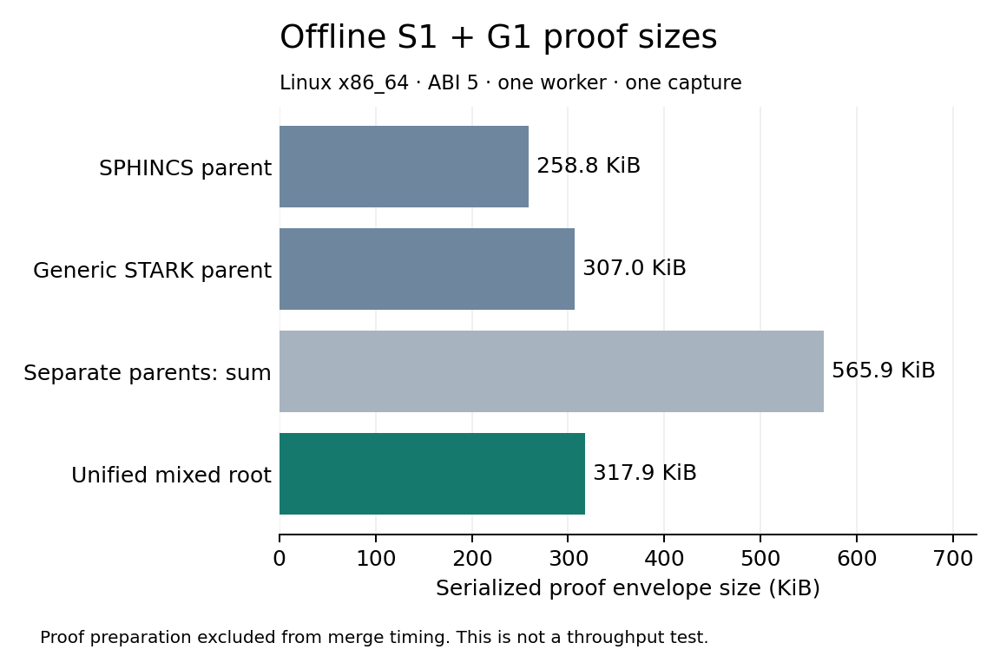

# Offline Linux mixed recursion: one small case

One genuine SPHINCS claim and one distinct generic STARK claim were prepared as separate recursive parents, then merged into one recursive root under the same guest key. The native C ABI verified the result. The root contains one mixed proof blob and its two canonical dependency triples; it carries neither application bytecode nor either inner proof.



| Object | Serialized envelope bytes |
| --- | ---: |
| SPHINCS parent | 265,052 |
| Generic STARK parent | 314,388 |
| Separate parents, sum | 579,440 |
| Unified mixed root | 325,548 |

The fresh merge process took **23.69 s** wall time: the probe measured **22.596 s** proving and **145.819 ms** final verification. GNU `time` reported a maximum resident set of **1,711,244 KiB (1.632 GiB)**. This is whole native-probe process RSS, including cold setup, parent verification, proving and final verification; it is not an isolated allocation count or a Runner memory guarantee. Parent preparation ran separately, with a 61.90 s process wall time and 3,636,812 KiB peak RSS. The preparation script also generated two signature/generic fixtures before the probe; those operations are excluded from the fresh merge interval.

This is **one offline capture**, with no warmup or repeated samples, no execution/beacon nodes and no network traffic. It establishes small-case recursive functionality and the captured byte sizes. It does not establish throughput, stable tail latency, slot-time compatibility, larger-program/dependency capacity, or the RAM margin for two concurrent client provers.

## Provenance and reproduce

The executable was built at source `899d7907c3f34966174350a71f2133cc97fd1317`, using fork `854997bd156f47f1b1ce2192c4499741f29bd0df`, ABI 5, inverse-rate log 1 and guest key `9370d760abb55fdf02acc7e8d40688c425815c3d25a2aea3c030b2ae1ab51ace`. The Linux x86_64 KVM host exposes six AMD EPYC 7642 cores. `LEANVM_NUM_THREADS=1`, `RUSTFLAGS='-C target-cpu=native'`; allocation poisoning was unset. [Native profile](native-profile.json), [CPU metadata](lscpu.txt), [proof geometry](proof-geometry.json) and [public artifact hashes](provenance.json) retain the actual captured configuration. The later validation revision records relay/test updates; it is not the probe's measured source revision.

From the recorded source checkout, with the pinned Rust toolchain:

```sh
export LEANVM_NUM_THREADS=1 RUSTFLAGS='-C target-cpu=native'
unset ZK_ALLOC_POISON
(cd tools/lean-ffi && cargo build --release --locked --example resource_probe)
/usr/bin/time -v tools/lean-ffi/target/release/examples/resource_probe mixed-prepare /tmp/mixed-probe
# Run this separately, after preparation exits:
/usr/bin/time -v tools/lean-ffi/target/release/examples/resource_probe mixed-merge /tmp/mixed-probe
python3 tools/LeanBench/results/2026-10-04/mixed/plot.py
```

The original [preparation CSV](mixed-prepare.csv) and [GNU time output](mixed-prepare.time) include an additional `bench_fixtures DIR 2 2` invocation in the preparation shell. The [merge CSV](mixed-merge.csv) and [GNU time output](mixed-merge.time) capture only the fresh merge command. New timings/proofs may differ; preserve their hashes separately. Public proof/input hashes are recorded, but full proof, fixture and executable binaries are intentionally untracked. [Checksums](sha256sums.txt) preserve every original raw file byte for byte.
