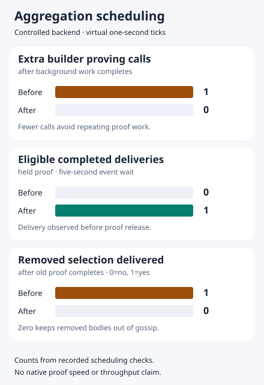

# Aggregation scheduling decisions

These are controlled decision checks, using synthetic statement-checked
dependency proofs and a manually advanced one-second timer. One scenario admits
a real secp256k1 signed FrameTx to the production pool and builds its actual block
body. No Lean performance, throughput or native one-second completion claim is
made. No services were started for these checks.

## Source attribution

The three observed decision changes were introduced by main commit
[`234fd20d11`](https://github.com/NethermindEth/nethermind/commit/234fd20d11c06d5b840fb0966bf933d151b178aa):
background-proof reuse in the block processor, delivery of completed work while
new work is proving, and suppression of removed selections. All three were
already observed in [the initial after capture](after-initial.json), at benchmark
revision `2d64c3b44b0e145a04a36d3208fecb2582eaf72c`.

Main revision `4a17b571f453d112bae5175a2e4966900201deae` subsequently removed
redundant verification, avoided copying/hashing an unchanged tick snapshot and
recovered rejected cache entries. It is part of the final measured validation
revision, rather than the origin of the three charted changes. The compared
source range also includes upstream master changes `c71261ecf6` (state handling),
`92d91836f4` (ZisK Keccak) and `fc24b807e4` (RPC typed converters). This chart
reports specific controlled decisions; it does not attribute general execution
speed or throughput to any single commit.

## Final identical-harness comparison

The immutable [baseline capture](before.json) uses production source
`c574cbb16a576c5121c1b0f9017920b776ab33a8`. It was rebuilt in a temporary detached
checkout with the same two revised harness files used for [the after capture](after.json).
The latter uses benchmark source `b61aa36458ea3ef09b064ca789f17a277aa708b0`,
which includes the final production merge `0d33ebadf13143f4af767ff558fa625c3fc622cf`
and main review fixes `4a17b571f4`. The overlaid harness changes are identified by
the source hashes below. Commit `7b6541653d30f41101750ae50e03ccb45e2f8fd8`
is the first committed revision containing that exact harness and can reproduce
the after run directly; its production sources are unchanged from `b61aa36458`.
Both runs passed seven rows; after additionally enabled
`--require-fresh=true`. The temporary baseline checkout was removed afterward.



| Decision | Before | After |
| --- | ---: | ---: |
| Extra builder prove after background proof | 1 | 0 |
| Eligible completed wrapper deliveries observed while new proving is held | 0 | 1 |
| Removed selection delivered after proving completes (0=no, 1=yes) | 1 | 0 |

The delivery row excludes the first cached-A offer regardless of execution time,
so an asynchronously delayed AddPeer callback cannot be counted as cadence
progress. It offers three initial virtual cadence notifications and waits for
an actual subsequent eligible delivery event for up to five wall-clock seconds,
offering additional virtual retry ticks every 100ms if needed. The new proof
remains held until observation ends. Baseline zero means no event was observed
in this finite window, not an assertion of permanent absence.

The recorded baseline observation lasted 5,037ms with 53 offered notifications
including the start tick; after observed the event during its initial three
cadence notifications (36ms elapsed, four notifications including start).
Those wall intervals include harness yields and are not native proving timings
or production latency guarantees. Retry counts differ because the identical
policy stops on the delivery event. The captures retain elapsed time, offered
initial/retry notifications and the event result.

Both runs retain one active proving call, skip proving across 120 unchanged
wrapper selections, reuse a proof after a transaction-body change, verify all
120 exact-parent builder reuse attempts, reject a damaged parent, and refresh a
completed wrapper without proving again. The separate 1/3/10-second values are
virtual blocked-clock scenarios. Their `sendsWhileBlocked` fields are
informational finite tick-phase snapshots, not latency or capacity assertions;
each records its actual observation interval.

## Preserved earlier captures

[before-previous.json](before-previous.json) and [after-previous.json](after-previous.json)
preserve the preceding fixed-delay comparison unchanged. They lack the new
event-window fields and are not the final comparison. Their harness source hash
was `58bece585e17db75d54300a399f35fc5de179b749a63e933ddea22dda7a0a017`;
the dispatch hash was unchanged. [before-original.json](before-original.json)
retains the earlier baseline before peer-offer accounting was refined.
[after-initial.json](after-initial.json) retains the initial implementation's
successful seven-row capture. None is relabeled as a final result.

Raw `commandLine` fields intentionally retain the original task-local output
and assembly paths as immutable invocation context. Those paths are not portable
reproduction instructions. Actual assembly hashes identify a particular build,
not a distinct source version: checkout paths, SourceLink and build flags may
change binary hashes. Git revisions plus the two file hashes identify source
content.

## Reproduction

The identical revised baseline and final-after harness sources have these SHA256 hashes:

| File | SHA256 |
| --- | --- |
| `SchedulingChecks.cs` | `dd9fce48cc9973ae7e271794c5b2862007600a5ea51af853458af53bfc505a24` |
| `Program.cs` | `211e47f4773444789bfcf4d5c4fcc169ed8655af21e9d001de03d92e40459813` |

Use [scheduling.md](../../../scheduling.md) to resolve the benchmark checkout to
an immutable commit, overlay **both** files into the detached baseline, verify
their hashes and run the isolated scheduling mode. The original baseline
entry point lacks that dispatch; it must not be invoked without the overlay.
Reproduce the mobile SVG from the immutable captures without extra dependencies:

```sh
python3 tools/LeanBench/scheduling_plot.py \
  tools/LeanBench/results/2026-10-04/scheduling/before.json \
  tools/LeanBench/results/2026-10-04/scheduling/after.json \
  --out=tools/LeanBench/results/2026-10-04/scheduling/decisions.svg
```

Proof-call counters cover the controlled backend. Real native integration tests
supply cryptographic validation separately. Virtual notifications can coalesce
while work is active; a tick is not a proof completion or a throughput sample.
